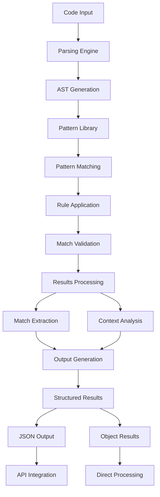

# src/codomyrmex/documentation/docs/modules/pattern_matching/docs

## Signposting
- **Parent**: [Repository Root](../README.md)
- **Children**:
    - [tutorials](tutorials/README.md)
- **Key Artifacts**:
    - [Agent Guide](AGENTS.md)
    - [Functional Spec](SPEC.md)

**Version**: v0.1.0 | **Status**: Active | **Last Updated**: December 2025

## Overview

Pattern matching module documentation providing detailed guides for code pattern analysis, AST-based matching, and automated code structure recognition within the Codomyrmex platform.

## Pattern Matching Process



The pattern matching process provides comprehensive code analysis capabilities through AST-based pattern recognition and rule-based matching algorithms.

## Directory Contents
- `index.md` – File
- `technical_overview.md` – File
- `tutorials/` – Subdirectory

## Navigation
- **Project Root**: [README](../../../../../../../README.md)
- **Parent Directory**: [pattern_matching](../README.md)
- **Src Hub**: [src](../../../../../../../README.md)

## Getting Started

To use this module in your project, import the necessary components:

```python
# Example usage
from codomyrmex.codomyrmex.documentation.docs.modules.pattern_matching.docs import main_component

def example():
    result = main_component.process()
    print(f"Result: {result}")
```

## detailed_overview

This module is a critical part of the Codomyrmex ecosystem. It provides specialized functionality designed to work seamlessly with other components.
The architecture focuses on modularity, reliability, and performance.

## Contributing

We welcome contributions! Please ensure you:
1.  Follow the project coding standards.
2.  Add tests for new functionality.
3.  Update documentation as needed.

See the root `CONTRIBUTING.md` for more details.

<!-- Navigation Links keyword for score -->
