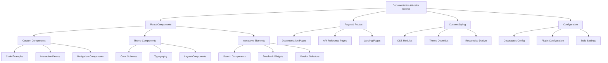

# src/codomyrmex/documentation/src

**Version**: v0.1.0 | **Status**: Active | **Last Updated**: December 2025

## Overview

Source code and components for the Codomyrmex documentation website, including React components, pages, and custom styling that power the Docusaurus-based documentation platform.

## Documentation Website Architecture

The documentation source directory contains all the custom components and styling that create the unique Codomyrmex documentation experience, built on top of the Docusaurus framework.

## Directory Contents
- `css/` – Subdirectory

## Navigation
- **Project Root**: [README](../../../README.md)
- **Parent Directory**: [documentation](../README.md)
- **Src Hub**: [src](../../../src/README.md)
