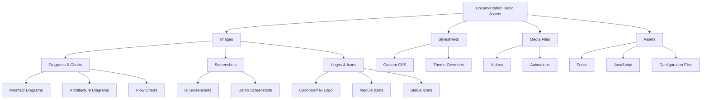

# src/codomyrmex/documentation/static

## Signposting
- **Parent**: [Parent](../README.md)
- **Children**:
    - [img](img/README.md)
- **Key Artifacts**:
    - [Agent Guide](AGENTS.md)
    - [Functional Spec](SPEC.md)

**Version**: v0.1.0 | **Status**: Active | **Last Updated**: December 2025

## Overview

Static assets and resources for the Codomyrmex documentation website, including images, stylesheets, and other media files that support the documentation ecosystem.

## Static Asset Organization

The static assets directory provides organized storage for all documentation website resources, ensuring consistent asset management and delivery.

## Directory Contents
- `img/` – Subdirectory

## Navigation
- **Project Root**: [README](../../../../README.md)
- **Parent Directory**: [documentation](../README.md)
- **Src Hub**: [src](../../../../src/README.md)