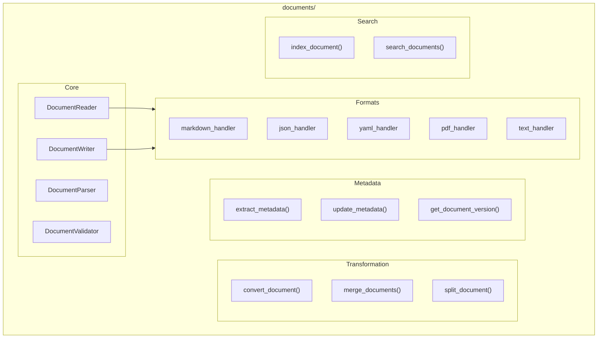

# Documents Module

**Version**: v0.1.0 | **Status**: Active | **Last Updated**: January 2026

## Overview

The Documents module provides robust, abstractable methods for reading and writing various document formats. It functions like a "printer's shop and library" - handling the mechanics of document I/O operations, distinct from the documentation module which focuses on technical documentation semantics.

## Architecture



## Key Classes

| Class | Purpose |
|-------|---------|
| `DocumentReader` | Read documents |
| `DocumentWriter` | Write documents |
| `DocumentParser` | Parse document content |
| `DocumentValidator` | Validate documents |
| `Document` | Document container |
| `DocumentFormat` | Format enum |
| `DocumentMetadata` | Metadata container |
| `PDFDocument` | PDF operations (optional) |

## Functions

### Core Operations

| Function | Purpose |
|----------|---------|
| `read_document()` | Read any document |
| `write_document()` | Write any document |
| `parse_document()` | Parse content |
| `validate_document()` | Validate document |

### Format-Specific

| Function | Purpose |
|----------|---------|
| `read_markdown()` / `write_markdown()` | Markdown I/O |
| `read_json()` / `write_json()` | JSON I/O |
| `read_yaml()` / `write_yaml()` | YAML I/O |
| `read_text()` / `write_text()` | Plain text I/O |
| `read_pdf()` / `write_pdf()` | PDF I/O (optional) |

### Transformation

| Function | Purpose |
|----------|---------|
| `convert_document()` | Convert between formats |
| `merge_documents()` | Merge multiple docs |
| `split_document()` | Split document |

## Quick Start

### Read/Write Documents

```python
from codomyrmex.documents import (
    read_document,
    write_document,
    read_markdown,
    read_json
)

# Generic read
doc = read_document("report.md")
print(doc.content)

# Format-specific
md_content = read_markdown("README.md")
config = read_json("config.json")

# Write
write_document("output.yaml", data)
```

### Document Conversion

```python
from codomyrmex.documents import convert_document

# Convert markdown to HTML
html = convert_document("doc.md", target_format="html")

# Convert YAML to JSON
json_doc = convert_document("config.yaml", target_format="json")
```

### Metadata

```python
from codomyrmex.documents import extract_metadata, update_metadata

meta = extract_metadata("document.pdf")
print(f"Author: {meta.author}, Created: {meta.created_at}")

update_metadata("document.pdf", {"author": "New Author"})
```

### Search

```python
from codomyrmex.documents import index_document, search_documents

# Index documents
index_document("docs/", recursive=True)

# Search
results = search_documents("configuration guide")
```

## Integration Points

- **logging_monitoring**: Document operation logging
- **cache**: Cache parsed documents
- **serialization**: Serialization integration

## Navigation

- **Parent**: [../README.md](../README.md)
- **Siblings**: [serialization](../serialization/), [scrape](../scrape/)
- **Spec**: [SPEC.md](SPEC.md)
