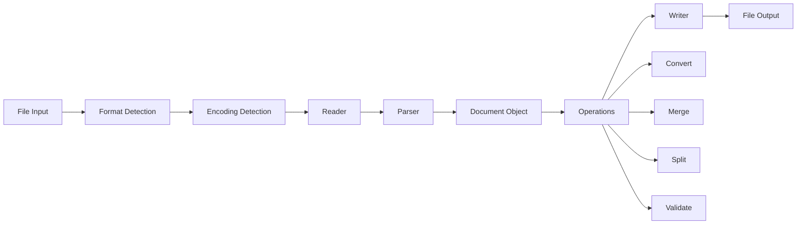

# src/codomyrmex/documents

## Signposting
- **Parent**: [codomyrmex](../README.md)
- **Children**:
    - [core](core/)
    - [formats](formats/)
    - [transformation](transformation/)
    - [metadata](metadata/)
    - [search](search/)
    - [templates](templates/)
    - [utils](utils/)
    - [models](models/)
- **Key Artifacts**:
    - [Agent Guide](AGENTS.md)
    - [Functional Spec](SPEC.md)

**Version**: v0.1.0 | **Status**: Active | **Last Updated**: December 2025

## Overview

The Documents module provides robust, abstractable methods for reading and writing various document formats. It functions like a "printer's shop and library or post office" - handling the mechanics of document I/O operations, distinct from the `documentation` module which focuses on the semantics of technical documentation.

This module supports multiple document formats, document operations (read, write, parse, validate, convert, merge, split), metadata extraction and management, document search and indexing, document templates and formatting, and document versioning.

## Document Processing Pipeline



The document processing pipeline handles format detection, encoding detection, reading, parsing, and various operations before writing output.

## Supported Formats

- **Markdown** (.md, .markdown) - Read/write with frontmatter support
- **JSON** (.json) - Read/write with schema validation
- **PDF** (.pdf) - Read text extraction, write generation
- **YAML** (.yaml, .yml) - Read/write with validation
- **XML** (.xml) - Read/write with parsing
- **CSV** (.csv) - Read/write with parsing
- **HTML** (.html, .htm) - Read/write with parsing
- **Plain Text** (.txt, .text) - Read/write with encoding handling
- **RTF** (.rtf) - Read/write support
- **Office Formats** (.docx, .xlsx) - Via libraries

## Core Operations

### Reading Documents

```python
from codomyrmex.documents import read_document, DocumentFormat

# Auto-detect format
doc = read_document("example.md")

# Specify format
doc = read_document("data.json", format=DocumentFormat.JSON)
```

### Writing Documents

```python
from codomyrmex.documents import write_document, Document

doc = Document(content="Hello, World!", format=DocumentFormat.MARKDOWN)
write_document(doc, "output.md")
```

### Format Conversion

```python
from codomyrmex.documents import convert_document, DocumentFormat

# Convert markdown to JSON
json_doc = convert_document(markdown_doc, DocumentFormat.JSON)
```

### Document Merging

```python
from codomyrmex.documents import merge_documents

merged = merge_documents([doc1, doc2, doc3])
```

### Document Splitting

```python
from codomyrmex.documents import split_document

# Split by sections
split_docs = split_document(doc, {"method": "by_sections"})

# Split by size
split_docs = split_document(doc, {"method": "by_size", "max_size": 10000})
```

### Metadata Operations

```python
from codomyrmex.documents import extract_metadata, update_metadata

# Extract metadata
metadata = extract_metadata("document.pdf")

# Update metadata
update_metadata("document.md", {"title": "New Title", "author": "Author Name"})
```

## Directory Contents

- `__init__.py` – Module initialization and public API
- `exceptions.py` – Module-specific exceptions
- `config.py` – Configuration management
- `core/` – Core document operations (reader, writer, parser, validator)
- `formats/` – Format-specific handlers
- `transformation/` – Document transformation (convert, merge, split)
- `metadata/` – Metadata operations
- `search/` – Document search and indexing
- `templates/` – Document templates
- `utils/` – Utilities (encoding detection, MIME type detection)
- `models/` – Data models (Document, DocumentMetadata)
- `docs/` – Additional documentation
- `tests/` – Test suite

## Integration

The Documents module integrates with:

- **Logging Monitoring** - Uses centralized logging system
- **Environment Setup** - Relies on environment validation
- **Documentation Module** - Complements documentation generation (semantics vs. mechanics)

## Navigation
- **Technical Documentation**: [AGENTS.md](AGENTS.md)
- **Functional Specification**: [SPEC.md](SPEC.md)

- **Project Root**: [README](../../../README.md)
- **Parent Directory**: [codomyrmex](../README.md)
- **Source Root**: [src](../../README.md)
- **API Reference**: [API_SPECIFICATION.md](API_SPECIFICATION.md)
- **Usage Examples**: [USAGE_EXAMPLES.md](USAGE_EXAMPLES.md)

## Getting Started

To use this module in your project, import the necessary components:

```python
# Example usage
from codomyrmex.codomyrmex.documents import main_component

def example():
    
    print(f"Result: {result}")
```

<!-- Navigation Links keyword for score -->
