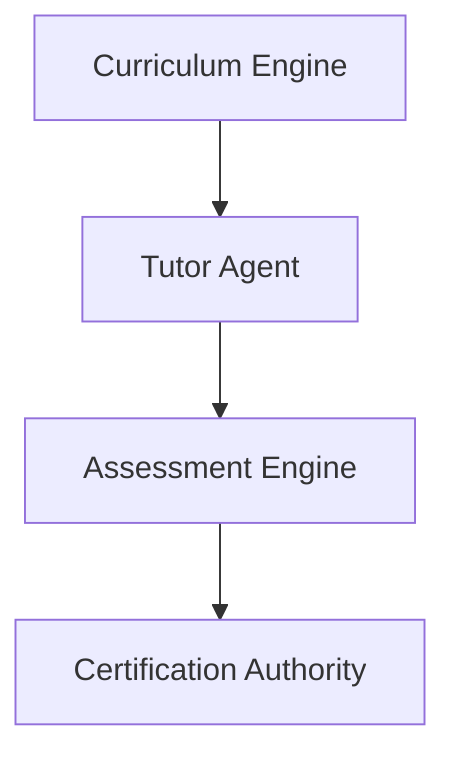

# Education - Functional Specification

**Version**: v0.1.0 | **Status**: Active | **Last Updated**: February 2026

## Purpose

Empower continuous learning for both human operators and autonomous agents through structured pedagogy and interactive mentorship.

## Design Principles

### Adaptive Learning

- Content adjusts to learner proficiency
- Dynamic pacing based on retention

### Verification

- Skills must be proven via assessment
- Cryptographically signed certificates

## Architecture

## Functional Requirements

1. **Curriculum**: Generate personalized learning paths.
2. **Tutoring**: Provide Socratic dialogue and explanation.
3. **Certification**: Verify and attest to skill mastery.

## Interface Contracts

- `Curriculum.generate(topic, level)`
- `Tutor.explain(concept, context)`
- `Certifier.verify(proof_of_work)`

## Navigation

- [README](README.md) | [AGENTS](AGENTS.md) | [Parent](../SPEC.md)
