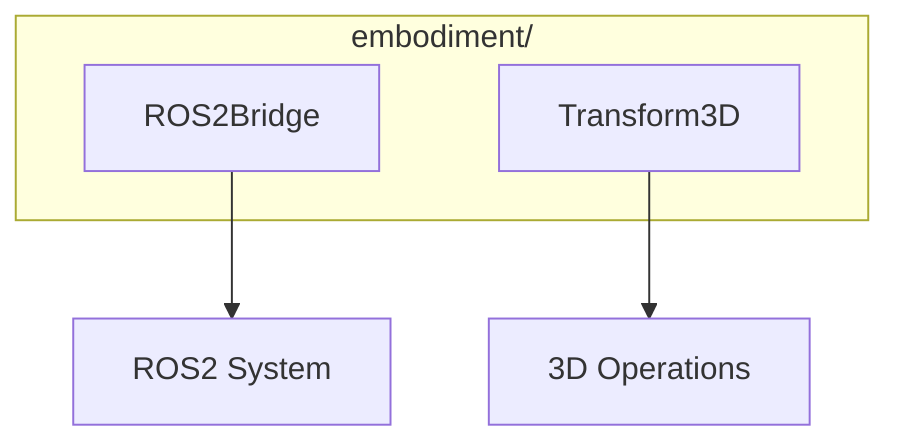

# Embodiment Module

**Version**: v0.1.0 | **Status**: Active | **Last Updated**: January 2026

## Overview

The Embodiment module provides robotics integration capabilities for the Codomyrmex platform, including ROS2 bridge functionality and 3D transformation utilities for physical robot control.

## Architecture



## Key Classes

| Class | Purpose |
|-------|---------|
| `ROS2Bridge` | Bridge to ROS2 ecosystem |
| `Transform3D` | 3D transformation utilities |

## Quick Start

### ROS2 Bridge

```python
from codomyrmex.embodiment import ROS2Bridge

# Connect to ROS2
bridge = ROS2Bridge()
bridge.connect()

# Subscribe to topic
bridge.subscribe("/sensor/data", callback=on_sensor_data)

# Publish to topic
bridge.publish("/cmd_vel", {
    "linear": {"x": 0.5, "y": 0, "z": 0},
    "angular": {"x": 0, "y": 0, "z": 0.1}
})
```

### 3D Transformations

```python
from codomyrmex.embodiment import Transform3D

# Create transformation
transform = Transform3D()

# Set position
transform.set_position(x=1.0, y=2.0, z=3.0)

# Set rotation (quaternion)
transform.set_rotation(x=0, y=0, z=0, w=1)

# Apply transformation
new_point = transform.apply([0, 0, 1])

# Compose transformations
combined = transform1.compose(transform2)
```

### Robot Control

```python
from codomyrmex.embodiment import ROS2Bridge, Transform3D

bridge = ROS2Bridge()

# Get robot pose
pose = bridge.get_transform("base_link", "odom")

# Command motion
target = Transform3D()
target.set_position(2.0, 0, 0)

bridge.send_goal("/move_base", target)
```

## Integration Points

- **physical_management**: Physical object simulation
- **spatial**: 3D math operations
- **agents**: Robot agents

## Navigation

- **Parent**: [../README.md](../README.md)
- **Siblings**: [physical_management](../physical_management/), [spatial](../spatial/)
- **Spec**: [SPEC.md](SPEC.md)
