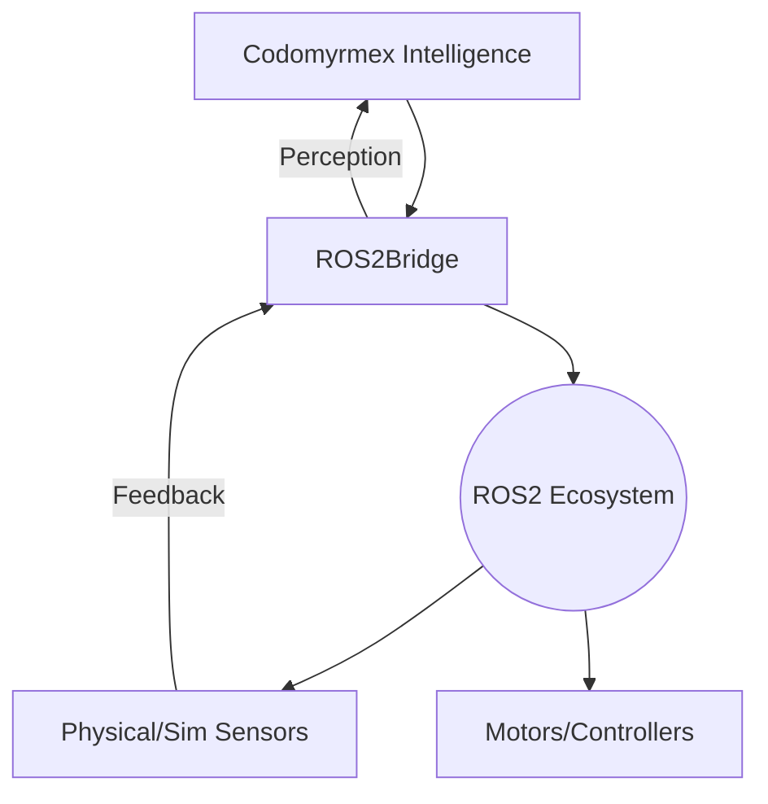

# embodiment - Functional Specification

## Purpose

To enable Codomyrmex agents to perceive, reason about, and interact with the physical world through robotic systems.

## Design Principles

- **Low Latency**: Control loops must meet real-time or near-real-time requirements.
- **Safety First**: Redundant checks for all physical actions.
- **Modular Hardware**: Easily adapt to different-shaped robots (drones, arms, rovers).
- **Sim-to-Real**: Ensure consistency between simulated and physical performance.

## Architecture



## Functional Requirements

- Connect to existing ROS2 networks.
- Serialize/Deserialize common ROS2 message types (SensorMsgs, GeometryMsgs).
- Implement a 'Watchdog' for connection loss detection.
- Scale sensor data (e.g., resizing high-res images before agent consumption).
- Enforce 'Soft Limits' on actuator velocity and acceleration.

## Interface Contracts

### `Transform3D`

- `from_translation(x, y, z) -> Transform3D`
- `from_rotation(roll, pitch, yaw) -> Transform3D`
- `apply(point: Tuple[float, float, float]) -> Tuple[float, float, float]`
- `inverse() -> Transform3D`

### `ROS2Bridge`

- `publish(topic: str, message: dict)`
- `subscribe(topic: str, callback: Callable)`

## Technical Constraints

- Dependent on the presence of a ROS2 runtime (e.g., Humble, Iron).
- High bandwidth requirement for vision-based embodiments.
- Real-time performance may be limited by Python's GC and GIL.

## Testing

```bash
uv run python -m pytest src/codomyrmex/tests/ -k embodiment -v
```
