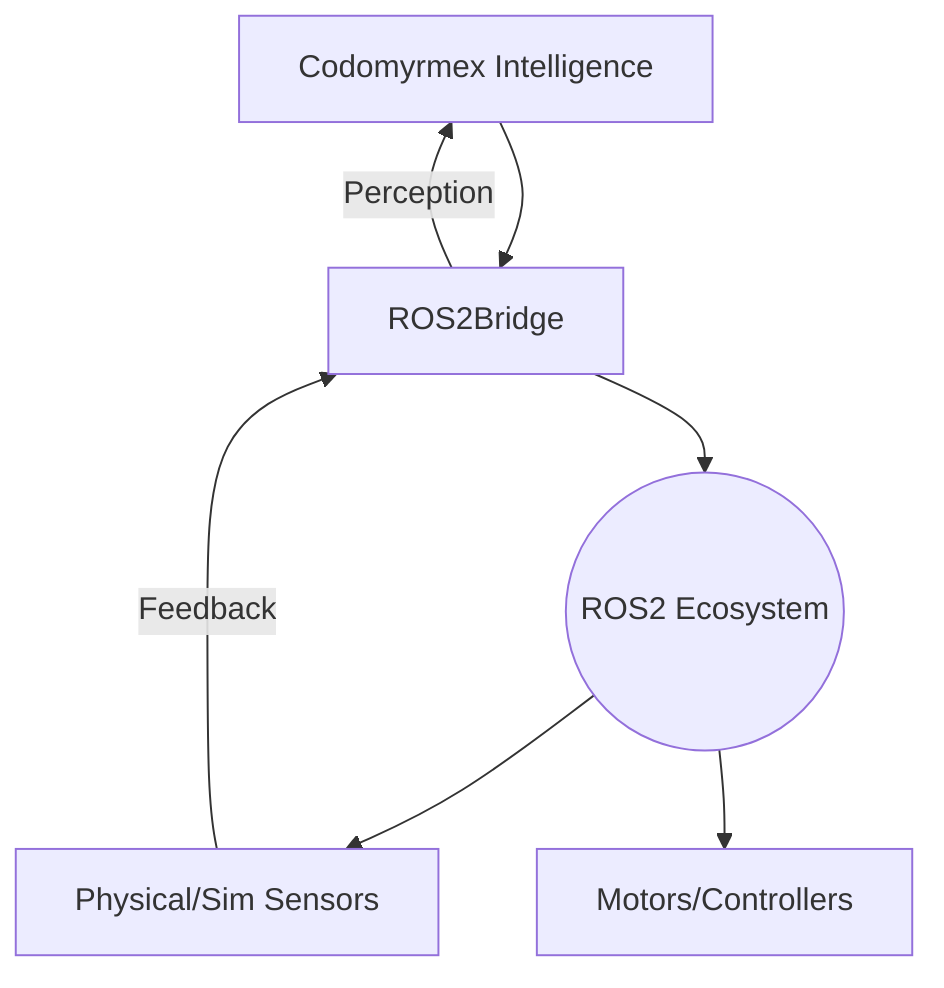

# embodiment - Functional Specification

**Version**: v1.1.0 | **Status**: Active | **Last Updated**: March 2026

## Purpose

To enable Codomyrmex agents to perceive, reason about, and interact with the physical world through robotic systems.

## Design Principles

- **Low Latency**: Control loops must meet real-time or near-real-time requirements.
- **Safety First**: Redundant checks for all physical actions.
- **Modular Hardware**: Easily adapt to different-shaped robots (drones, arms, rovers).
- **Sim-to-Real**: Ensure consistency between simulated and physical performance.

## Architecture


```mermaid
graph TD
    Brain[Codomyrmex Intelligence] --> Bridge[ROS2Bridge]
    Bridge --> ROS2((ROS2 Ecosystem))
    ROS2 --> Sensors[Physical/Sim Sensors]
    ROS2 --> Actuators[Motors/Controllers]
    Sensors -->|Feedback| Bridge
    Bridge -->|Perception| Brain
```

## Functional Requirements

- Connect to existing ROS2 networks (simulated).
- Serialize/Deserialize common ROS2 message types.
- Implement a 'Watchdog' for connection loss detection.
- Scale sensor data before agent consumption.
- Enforce 'Soft Limits' on actuator velocity and acceleration.
- Provide async interface for I/O operations.

## Interface Contracts

### `Transform3D`

- `from_translation(x, y, z) -> Transform3D`
- `from_rotation(roll, pitch, yaw) -> Transform3D`
- `from_yaw(yaw_rad) -> Transform3D`
- `apply(point: Tuple[float, float, float]) -> Tuple[float, float, float]`
- `compose(other: Transform3D) -> Transform3D`
- `inverse() -> Transform3D`

### `ROS2Bridge`

- `connect(uri: str) -> bool` (async)
- `disconnect() -> None`
- `publish(topic: str, message: dict) -> Message` (async)
- `subscribe(topic: str, callback: Callable) -> UnsubscribeHandle` (async)

### `SensorInterface`

- `connect() -> bool`
- `disconnect() -> None`
- `read() -> SensorData`

### `ActuatorController`

- `connect() -> bool`
- `disconnect() -> None`
- `execute(command: ActuatorCommand) -> bool`
- `get_status() -> ActuatorStatus`

## Technical Constraints

- Dependent on the presence of a ROS2 runtime for physical hardware (not for simulation).
- High bandwidth requirement for vision-based embodiments.
- Real-time performance may be limited by Python's GC and GIL.

## Testing

```bash
uv run python -m pytest src/codomyrmex/tests/ -k embodiment -v
```
