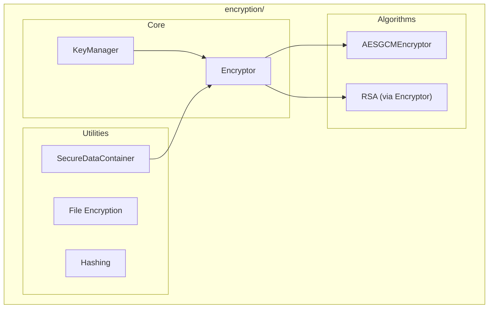

# Encryption Module

**Version**: v0.1.0 | **Status**: Active | **Last Updated**: January 2026

## Overview

The Encryption module provides cryptographic utilities for the Codomyrmex platform, including AES-256 symmetric encryption, RSA asymmetric encryption, key management, digital signatures, and secure hashing.

## Architecture



## Key Classes

| Class | Purpose |
|-------|---------|
| `Encryptor` | Core encryption/decryption operations |
| `KeyManager` | Key generation, storage, and rotation |
| `AESGCMEncryptor` | AES-GCM authenticated encryption |
| `SecureDataContainer` | Encrypted data wrapper with metadata |

## Functions

| Function | Description |
|----------|-------------|
| `encrypt(data, key)` | Encrypt bytes with key |
| `decrypt(data, key)` | Decrypt bytes with key |
| `generate_key()` | Generate new encryption key |
| `encrypt_file(in, out, key)` | Encrypt a file |
| `decrypt_file(in, out, key)` | Decrypt a file |
| `hash_data(data, algorithm)` | Compute secure hash |
| `get_encryptor()` | Get configured encryptor instance |

## Quick Start

### Basic Encryption

```python
from codomyrmex.encryption import encrypt, decrypt, generate_key

# Generate a key
key = generate_key()

# Encrypt data
plaintext = b"sensitive data"
ciphertext = encrypt(plaintext, key)

# Decrypt data
decrypted = decrypt(ciphertext, key)
assert decrypted == plaintext
```

### File Encryption

```python
from codomyrmex.encryption import encrypt_file, decrypt_file, generate_key

key = generate_key()

# Encrypt a file
encrypt_file("secrets.txt", "secrets.enc", key)

# Decrypt a file
decrypt_file("secrets.enc", "secrets_decrypted.txt", key)
```

### Key Management

```python
from codomyrmex.encryption import KeyManager

km = KeyManager()

# Generate and store a named key
km.generate("api_key", algorithm="AES")

# Retrieve key for use
key = km.get("api_key")

# Rotate key (generates new, archives old)
km.rotate("api_key")
```

### Secure Hashing

```python
from codomyrmex.encryption import hash_data

data = b"content to verify"

# SHA-256 hash (default)
digest = hash_data(data)

# SHA-512 hash
digest_512 = hash_data(data, algorithm="sha512")
```

### AES-GCM Authenticated Encryption

```python
from codomyrmex.encryption import AESGCMEncryptor

encryptor = AESGCMEncryptor()
key = encryptor.generate_key()

# Encrypt with authentication
ciphertext, nonce, tag = encryptor.encrypt(plaintext, key)

# Decrypt and verify
plaintext = encryptor.decrypt(ciphertext, key, nonce, tag)
```

## Security Notes

> [!CAUTION]
>
> - Never hardcode encryption keys
> - Store keys in environment variables or secure vaults
> - Use `KeyManager` for key lifecycle management
> - AES-GCM provides authenticated encryption (recommended)

## Integration Points

- **security**: Credential and secret management
- **auth**: Token encryption
- **database_management**: Encrypted field storage
- **config_management**: Encrypted config values

## Navigation

- **Parent**: [../README.md](../README.md)
- **Siblings**: [security](../security/), [auth](../auth/)
- **Spec**: [SPEC.md](SPEC.md)
