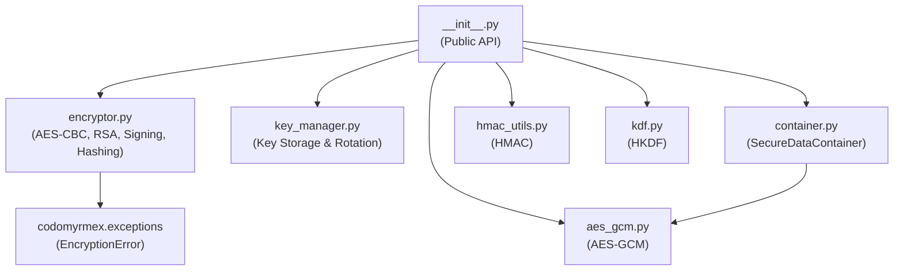

# encryption - Functional Specification

**Version**: v0.1.0 | **Status**: Active | **Last Updated**: February 2026

## Purpose

Encryption module providing encryption/decryption utilities, key management, HMAC authentication, and key derivation. Integrates with `security` and `config_management` modules.

## Design Principles

### Modularity

- Algorithm-agnostic encryption interface
- Support for multiple encryption algorithms (AES-CBC, AES-GCM, RSA)
- Pluggable encryption system with separate files per concern

### Internal Coherence

- Unified encryption/decryption API
- Consistent key management patterns
- Single `EncryptionError` exception defined in `codomyrmex.exceptions`

### Parsimony

- Essential encryption operations
- Minimal dependencies (`cryptography` + stdlib)
- Focus on commonly needed algorithms

### Functionality

- Working implementations for AES-CBC, AES-GCM, RSA
- HMAC message authentication with timing-safe verification
- HKDF and PBKDF2 key derivation
- File-based key management with rotation support
- SecureDataContainer for encrypted JSON storage

### Testing

- Unit tests for all algorithms and utilities
- Integration tests for KeyManager + Encryptor workflows
- Edge case coverage (empty data, binary data, key rotation)

### Documentation

- Complete API specifications for all classes and functions
- Usage examples for each feature
- Security notes and best practices

## Architecture



## Functional Requirements

### Core Operations

1. **Encrypt**: Encrypt data with AES-CBC, AES-GCM, or RSA
2. **Decrypt**: Decrypt data with matching algorithm
3. **Authenticated Encryption**: AES-GCM with optional associated data
4. **Key Management**: Generate, store, retrieve, list, rotate, delete keys
5. **Key Derivation**: PBKDF2 for passwords, HKDF for high-entropy material
6. **HMAC**: Compute and verify message authentication codes
7. **Signing**: RSA-PSS digital signatures
8. **Hashing**: SHA-256, SHA-384, SHA-512, MD5 digests
9. **File Encryption**: Encrypt/decrypt files to disk
10. **Secure Container**: Encrypt arbitrary JSON-serializable data

### Integration Points

- `security/` - Security integration
- `config_management/` - Secret encryption
- `documents/` - Document encryption

## Quality Standards

### Code Quality

- Type hints for all functions
- PEP 8 compliance
- Comprehensive error handling via EncryptionError

### Testing Standards

- >=80% coverage
- Algorithm-specific tests
- Security and edge case testing

### Documentation Standards

- README.md, SPEC.md, API_SPECIFICATION.md
- MCP_TOOL_SPECIFICATION.md

## Interface Contracts

### Encryption Interface

```python
class Encryptor:
    def encrypt(data: bytes, key: bytes) -> bytes
    def decrypt(data: bytes, key: bytes) -> bytes
    def generate_key() -> bytes
    def derive_key(password: str, salt: bytes) -> bytes
```

### Authenticated Encryption Interface

```python
class AESGCMEncryptor:
    def encrypt(data: bytes, associated_data: Optional[bytes] = None) -> bytes
    def decrypt(data: bytes, associated_data: Optional[bytes] = None) -> bytes
```

### HMAC Interface

```python
def compute_hmac(data, key, algorithm="sha256") -> bytes
def verify_hmac(data, key, expected_mac, algorithm="sha256") -> bool
```

### KDF Interface

```python
def derive_key_hkdf(input_key_material, length=32, salt=None, info=None, algorithm="sha256") -> bytes
```

## Navigation

- **Parent**: [codomyrmex](../AGENTS.md)
- **Related**: [security](../security/AGENTS.md), [config_management](../config_management/AGENTS.md)
