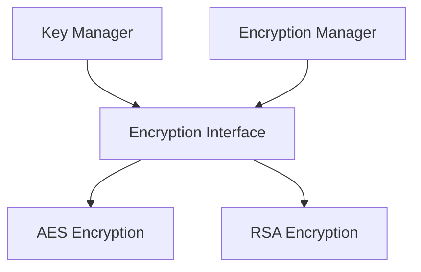

# encryption - Functional Specification

**Version**: v0.1.0 | **Status**: Proposed | **Last Updated**: December 2025

## Purpose

Encryption module providing encryption/decryption utilities and key management. Integrates with `security` and `config_management` modules.

## Design Principles

### Modularity
- Algorithm-agnostic encryption interface
- Support for multiple encryption algorithms
- Pluggable encryption system

### Internal Coherence
- Unified encryption/decryption
- Consistent key management patterns
- Integration with security

### Parsimony
- Essential encryption operations
- Minimal dependencies
- Focus on common algorithms

### Functionality
- Working implementations for common algorithms
- Support for symmetric and asymmetric encryption
- Key derivation and management

### Testing
- Unit tests for all algorithms
- Integration tests with key management
- Security testing

### Documentation
- Complete API specifications
- Usage examples for each algorithm
- SECURITY.md with best practices

## Architecture



## Functional Requirements

### Core Operations
1. **Encrypt**: Encrypt data with various algorithms
2. **Decrypt**: Decrypt data with various algorithms
3. **Key Management**: Generate, store, and retrieve keys
4. **Key Derivation**: Derive keys from passwords
5. **Signing**: Digital signature support

### Integration Points
- `security/` - Security integration
- `config_management/` - Secret encryption
- `documents/` - Document encryption

## Quality Standards

### Code Quality
- Type hints for all functions
- PEP 8 compliance
- Comprehensive security handling

### Testing Standards
- ≥80% coverage
- Algorithm-specific tests
- Security testing

### Documentation Standards
- README.md, AGENTS.md, SPEC.md
- API_SPECIFICATION.md
- SECURITY.md

## Interface Contracts

### Encryption Interface
```python
class Encryptor:
    def encrypt(data: bytes, key: bytes) -> bytes
    def decrypt(data: bytes, key: bytes) -> bytes
    def generate_key() -> bytes
    def derive_key(password: str, salt: bytes) -> bytes
```

## Implementation Guidelines

### Encryption Implementation
1. Implement Encryption interface for each algorithm
2. Handle encryption/decryption errors securely
3. Support key management
4. Provide secure key storage

### Integration
1. Integrate with security module
2. Add encryption to config_management
3. Support document encryption

## Navigation

- **Parent**: [codomyrmex](../AGENTS.md)
- **Related**: [security](../security/AGENTS.md), [config_management](../config_management/AGENTS.md)

