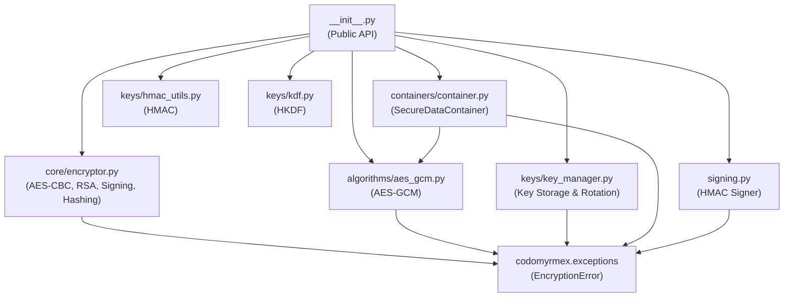

# encryption - Functional Specification

**Version**: v1.0.1 | **Status**: Active | **Last Updated**: January 2025

## Purpose

Encryption module providing encryption/decryption utilities, key management, HMAC authentication, and key derivation. Integrates with `security` and `config_management` modules.

## Design Principles

### Modularity

- Algorithm-agnostic encryption interface (`Encryptor`)
- Support for multiple encryption algorithms (AES-CBC, AES-GCM, RSA)
- Pluggable encryption system with separate directories per concern

### Internal Coherence

- Unified encryption/decryption API
- Consistent key management patterns
- Single `EncryptionError` exception defined in `codomyrmex.exceptions`

### Parsimony

- Essential encryption operations only
- Minimal dependencies (`cryptography` + stdlib)
- Focus on commonly needed and industry-standard algorithms

### Functionality

- Working implementations for AES-CBC, AES-GCM, RSA
- HMAC message authentication with timing-safe verification
- HKDF and PBKDF2 key derivation
- File-based key management with rotation support
- `SecureDataContainer` for encrypted JSON storage
- `Signer` class for fast HMAC-based JSON/file signatures

### Testing

- Strictly zero-mock unit tests for all algorithms and utilities
- Integration tests for `KeyManager` + `Encryptor` workflows
- Edge case coverage (empty data, binary data, key rotation, tampered data)

### Documentation

- Complete API specifications for all classes and functions
- Usage examples for each feature
- Security notes and best practices

## Architecture


```mermaid
graph TD
    Init["__init__.py<br/>(Public API)"]
    Enc["core/encryptor.py<br/>(AES-CBC, RSA, Signing, Hashing)"]
    GCM["algorithms/aes_gcm.py<br/>(AES-GCM)"]
    KM["keys/key_manager.py<br/>(Key Storage & Rotation)"]
    SDC["containers/container.py<br/>(SecureDataContainer)"]
    HMAC["keys/hmac_utils.py<br/>(HMAC)"]
    KDF["keys/kdf.py<br/>(HKDF)"]
    Exc["codomyrmex.exceptions<br/>(EncryptionError)"]
    Sign["signing.py<br/>(HMAC Signer)"]

    Init --> Enc
    Init --> GCM
    Init --> KM
    Init --> SDC
    Init --> HMAC
    Init --> KDF
    Init --> Sign
    SDC --> GCM
    Enc --> Exc
    GCM --> Exc
    KM --> Exc
    SDC --> Exc
    Sign --> Exc
```

## Functional Requirements

### Core Operations

1. **Encrypt**: Encrypt data with AES-CBC, AES-GCM, or RSA
2. **Decrypt**: Decrypt data with matching algorithm
3. **Authenticated Encryption**: AES-GCM with optional associated data
4. **Key Management**: Generate, store, retrieve, list, rotate, delete keys
5. **Key Derivation**: PBKDF2 for passwords, HKDF for high-entropy material
6. **HMAC**: Compute and verify message authentication codes
7. **Signing (Asymmetric)**: RSA-PSS digital signatures
8. **Signing (Symmetric)**: HMAC-based JSON and file signing
9. **Hashing**: SHA-256, SHA-384, SHA-512, MD5 digests
10. **File Encryption**: Encrypt/decrypt files to disk
11. **Secure Container**: Encrypt arbitrary JSON-serializable data

### Integration Points

- `security/` - Security integration
- `config_management/` - Secret encryption
- `documents/` - Document encryption

## Quality Standards

### Code Quality

- Mandatory type hints for all functions
- PEP 8 compliance
- Comprehensive error handling via `EncryptionError`
- Restrictive file permissions (0o600) for stored keys

### Testing Standards

- Strictly zero-mock testing using real `cryptography`
- >=80% coverage
- Algorithm-specific tests
- Security and edge case testing (including tampered data detection)

### Documentation Standards

- README.md, SPEC.md, API_SPECIFICATION.md
- MCP_TOOL_SPECIFICATION.md

## Interface Contracts

### Encryption Interface (Encryptor)

```python
class Encryptor:
    def encrypt(data: bytes, key: bytes) -> bytes
    def decrypt(data: bytes, key: bytes) -> bytes
    def encrypt_string(plaintext: str, key: bytes, encoding: str = "utf-8") -> str
    def decrypt_string(ciphertext: str, key: bytes, encoding: str = "utf-8") -> str
    def encrypt_file(input_path: str, output_path: str, key: bytes) -> bool
    def decrypt_file(input_path: str, output_path: str, key: bytes) -> bool
    def generate_key() -> bytes
    def generate_key_pair(key_size: int = 2048) -> Tuple[bytes, bytes]
    def derive_key(password: str, salt: bytes) -> bytes
    def sign(data: bytes, private_key: bytes) -> bytes
    def verify(data: bytes, signature: bytes, public_key: bytes) -> bool
```

### Digital Signatures (HMAC-based Signer)

```python
class Signer:
    def sign(data: str | bytes, key_id: str = "") -> SignatureResult
    def verify(data: str | bytes, signature: str) -> bool
    def sign_json(obj: Dict[str, Any], key_id: str = "") -> Dict[str, Any]
    def verify_json(signed_obj: Dict[str, Any]) -> bool

def sign_file(path: Path, secret_key: str) -> str
def verify_file(path: Path, signature: str, secret_key: str) -> bool
```

### Key Management

```python
class KeyManager:
    def store_key(key_id: str, key: bytes) -> bool
    def get_key(key_id: str) -> Optional[bytes]
    def delete_key(key_id: str) -> bool
    def list_keys() -> List[str]
    def key_exists(key_id: str) -> bool
    def rotate_key(key_id: str, new_key: bytes) -> Optional[bytes]
```

### Secure Data Container

```python
class SecureDataContainer:
    def pack(data: Any, metadata: Dict[str, Any] | None = None) -> bytes
    def unpack(encrypted_data: bytes) -> Dict[str, Any]
```

### Authenticated Encryption Interface

```python
class AESGCMEncryptor:
    def encrypt(data: bytes, associated_data: Optional[bytes] = None) -> bytes
    def decrypt(data: bytes, associated_data: Optional[bytes] = None) -> bytes
```

### HMAC Interface

```python
def compute_hmac(data, key, algorithm="sha256") -> bytes
def verify_hmac(data, key, expected_mac, algorithm="sha256") -> bool
```

### KDF Interface

```python
def derive_key_hkdf(input_key_material, length=32, salt=None, info=None, algorithm="sha256") -> bytes
```

## Navigation

- **Parent**: [codomyrmex](../AGENTS.md)
- **Related**: [security](../security/AGENTS.md), [config_management](../config_management/AGENTS.md)
