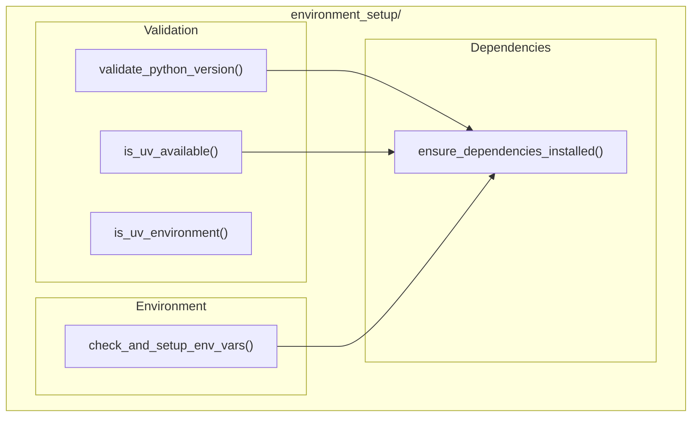

# Environment Setup Module

**Version**: v0.1.0 | **Status**: Active | **Last Updated**: January 2026

## Overview

The Environment Setup module provides development environment setup and validation for the Codomyrmex platform. It handles Python version validation, dependency management (including uv support), and environment variable configuration.

## Architecture



## Functions

| Function | Purpose |
|----------|---------|
| `is_uv_available()` | Check if uv package manager is installed |
| `is_uv_environment()` | Check if running in uv-managed environment |
| `ensure_dependencies_installed()` | Install missing dependencies |
| `check_and_setup_env_vars()` | Validate and setup env vars |
| `validate_python_version()` | Verify Python version meets requirements |

## Quick Start

### Check Python Version

```python
from codomyrmex.environment_setup import validate_python_version

# Check if Python 3.10+ is available
if validate_python_version(minimum="3.10"):
    print("Python version OK")
else:
    print("Python 3.10+ required")
```

### Check uv Availability

```python
from codomyrmex.environment_setup import is_uv_available, is_uv_environment

if is_uv_available():
    print("uv is installed")
    
if is_uv_environment():
    print("Running in uv-managed environment")
```

### Ensure Dependencies

```python
from codomyrmex.environment_setup import ensure_dependencies_installed

# Install required packages
ensure_dependencies_installed([
    "requests>=2.28",
    "pyyaml>=6.0",
    "rich>=13.0"
])
```

### Environment Variables

```python
from codomyrmex.environment_setup import check_and_setup_env_vars

# Validate required env vars
required = {
    "CODOMYRMEX_API_KEY": "API key for external services",
    "CODOMYRMEX_LOG_LEVEL": "Logging level (DEBUG, INFO, WARNING)"
}

missing = check_and_setup_env_vars(required)
if missing:
    print(f"Missing env vars: {missing}")
```

## Integration Points

- **logging_monitoring**: Uses for logging during setup
- **All modules**: Foundation module that others depend on
- **config_management**: Environment-specific configuration

## Navigation

- **Parent**: [../README.md](../README.md)
- **Siblings**: [config_management](../config_management/), [logging_monitoring](../logging_monitoring/)
- **Spec**: [SPEC.md](SPEC.md)
