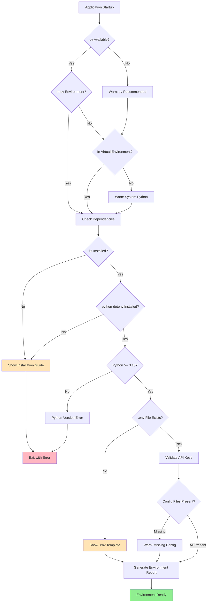

# src/codomyrmex/environment_setup

## Signposting
- **Parent**: [codomyrmex](../README.md)
- **Children**:
    - [docs](docs/README.md)
    - [scripts](scripts/README.md)
    - [tests](tests/README.md)
- **Key Artifacts**:
    - [Agent Guide](AGENTS.md)
    - [Functional Spec](SPEC.md)

**Version**: v0.1.0 | **Status**: Active | **Last Updated**: December 2025

## Overview

Foundation module providing environment validation and setup utilities for the Codomyrmex platform. This module ensures that development and runtime environments are properly configured with required dependencies, API keys, and environment variables before other modules initialize.

## Environment Validation Flow



## Key Features

- **Package Manager Detection**: Identifies uv, virtual environments, or system Python
- **Dependency Validation**: Checks for required packages (kit, python-dotenv)
- **Python Version Validation**: Ensures Python ≥3.10
- **Environment File Management**: Validates .env file presence and provides templates
- **Configuration Validation**: Checks for pyproject.toml, requirements.txt
- **Installation Guidance**: Provides clear, actionable setup instructions

## Directory Contents
- `.cursor/` – Subdirectory
- `.gitignore` – File
- `API_SPECIFICATION.md` – File
- `CHANGELOG.md` – File
- `MCP_TOOL_SPECIFICATION.md` – File
- `SECURITY.md` – File
- `USAGE_EXAMPLES.md` – File
- `__init__.py` – File
- `docs/` – Subdirectory
- `env_checker.py` – File
- `requirements.txt` – File
- `scripts/` – Subdirectory
- `tests/` – Subdirectory

## Navigation
- **Technical Documentation**: [AGENTS.md](AGENTS.md)
- **Functional Specification**: [SPEC.md](SPEC.md)
- **Project Root**: [README](../../../README.md)
- **Parent Directory**: [codomyrmex](../README.md)
- **Src Hub**: [src](../../../src/README.md)

## Getting Started

To use this module in your project, import the necessary components:

```python
# Example usage
from codomyrmex.codomyrmex.environment_setup import main_component

def example():
    
    print(f"Result: {result}")
```

<!-- Navigation Links keyword for score -->
