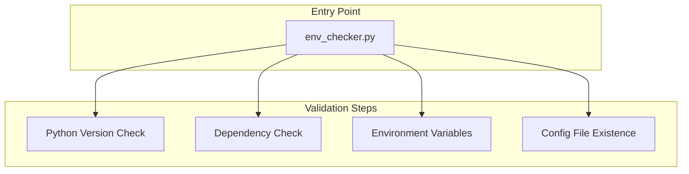

# environment_setup - Functional Specification

**Version**: v0.1.0 | **Status**: Active | **Last Updated**: January 2026

## Purpose

The `environment_setup` module ensures the Codomyrmex platform runs in a deterministic, validated environment. It acts as the "gatekeeper" at startup, verifying dependencies, Python versions, and configuration integrity before any other module is allowed to execute.

## Design Principles

### Modularity
- **Self-Contained**: Does not depend on other Codomyrmex modules (except potentially foundational logging via string imports to avoid circularity).
- **Public API**: Exposes simple boolean checks and void setup functions.

### Internal Coherence
- **Fail Fast**: If the environment is invalid (e.g., wrong Python version), it should fail immediately and explicitly.
- **Helpful Errors**: Error messages must guide the user to the solution (e.g., "Install `kit` via `pip install kit`").

### Parsimony
- **Scope Limited**: Only concerns itself with the *runtime environment*. Does NOT handle application logic or build synthesis.

### Functionality
- **Idempotency**: Setup functions can be run multiple times without side effects.
- **Cross-Platform**: Should work on macOS and Linux (Windows support best-effort).

### Testing
- **Integration Tests**: Validates behavior in both virtual environments and system python contexts.

## Architecture

## Functional Requirements

### Core Capabilities
1.  **Python Version Validation**: Enforce Python >= 3.10.
2.  **Manager Detection**: Detect if running under `uv`, `venv`, or system python.
3.  **Dependency Validation**: Check for critical packages (`kit`, `dotenv`, `openai` etc.).
4.  **Configuration**: Load and validate `.env` files.

### Quality Standards
- **Zero External Deps**: Should minimize dependencies to run the checker itself (use stdlib where possible).
- **Speed**: Checks should run in milliseconds to not slow down startup.

## Interface Contracts

### Public API
- `validate_environment() -> bool`: Main entry point. Returns True if all checks pass.
- `check_dependencies() -> dict`: Returns a report of installed vs required packages.
- `load_environment() -> None`: Loads `.env` into `os.environ`.

### Dependencies
- **Standard Library**: `os`, `sys`, `importlib`, `pathlib`.
- **External**: `python-dotenv` (optional for checking, but required for loading).

## Implementation Guidelines

### Usage Patterns
- Call `validate_environment()` at the very top of `__main__` blocks or entry scripts.
- Use `load_environment()` before importing modules that require API keys.

## Navigation

- **Human Documentation**: [README.md](README.md)
- **Technical Documentation**: [AGENTS.md](AGENTS.md)
- **Package SPEC**: [../SPEC.md](../SPEC.md)

<!-- Navigation Links keyword for score -->
