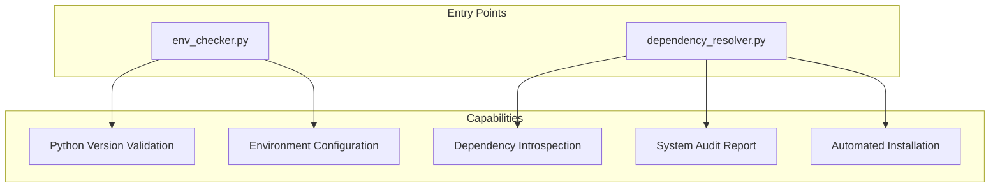

# environment_setup - Functional Specification

**Version**: v1.1.9 | **Status**: Active | **Last Updated**: March 2026

## Purpose

The `environment_setup` module ensures the Codomyrmex platform runs in a deterministic, validated environment. It acts as the "gatekeeper" at startup, verifying dependencies, Python versions, and configuration integrity before any other module is allowed to execute.

## Design Principles

### Modularity

- **Self-Contained**: Minimizes dependencies on other Codomyrmex modules.
- **Public API**: Exposes structured reports (ValidationReport, DependencyStatus, APIKeyReport).

### Internal Coherence

- **Fail Fast**: Explicit failure if environment is invalid.
- **Actionable Feedback**: Guides the user toward setup resolution.

### Parsimony

- **Scope Limited**: Focused on runtime environment health.

### Functionality

- **Idempotency**: Safe to call repeatedly.
- **Cross-Platform**: Support for macOS and Linux.

### Testing

- **Zero-Mock Policy**: Focus on real system/environment interaction where possible.

## Architecture

```mermaid
graph TD
    subgraph "Entry Points"
        EnvChecker[env_checker.py]
        DepResolver[dependency_resolver.py]
    end

    subgraph "Capabilities"
        PythonCheck[Python Version Validation]
        DepCheck[Dependency Introspection]
        EnvVarCheck[Environment Configuration]
        Audit[System Audit Report]
        Install[Automated Installation]
    end

    EnvChecker --> PythonCheck
    EnvChecker --> EnvVarCheck
    DepResolver --> DepCheck
    DepResolver --> Audit
    DepResolver --> Install
```

## Functional Requirements

### Core Capabilities

1. **Python Version Validation**: Enforce Python >= 3.10 (customizable).
2. **Manager Detection**: Detect `uv`, `venv`, `conda`, and system contexts.
3. **Dependency Validation**: Deep inspection of installed vs required packages.
4. **Configuration**: Seamless `.env` loading and required key validation.
5. **Conflict Resolution**: Identify and suggest fixes for package conflicts.

### Quality Standards

- **Standard Library First**: Use stdlib to minimize setup-of-setup issues.
- **Performance**: Millisecond-level overhead for core checks.

## Interface Contracts

### Public API (Highlights)

- `validate_environment(min_python) -> ValidationReport`: Aggregated system check.
- `check_dependencies(list) -> List[DependencyStatus]`: Check if specific packages exist.
- `ensure_dependencies_installed(list) -> bool`: Check and log missing packages.
- `install_dependencies(source) -> bool`: Trigger `uv` or `pip` to install packages.
- `check_and_setup_env_vars(root, req, opt) -> List[str]`: Load .env and check keys.
- `check_api_keys(keys) -> APIKeyReport`: Specific check for credentials.

### Dependencies

- **Standard Library**: `os`, `sys`, `importlib`, `pathlib`, `shutil`, `subprocess`.
- **External**: `python-dotenv`.

## Implementation Guidelines

### Usage Patterns

- Call `validate_environment()` during initialization.
- Use `check_and_setup_env_vars()` to prepare `os.environ`.
- Use `DependencyResolver` for deeper system health audits.

## Navigation

- **Human Documentation**: [README.md](README.md)
- **Technical Documentation**: [AGENTS.md](AGENTS.md)
- **Package SPEC**: [../SPEC.md](../SPEC.md)
