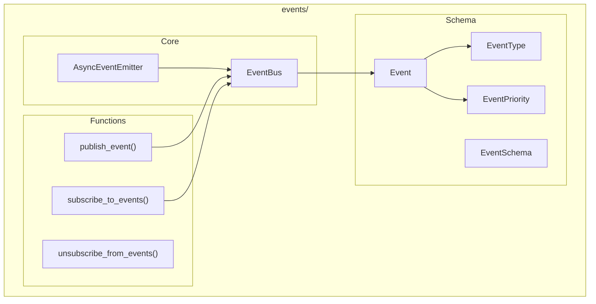

# Events Module

**Version**: v0.1.0 | **Status**: Active | **Last Updated**: January 2026

## Overview

The Events module provides an event-driven architecture for the Codomyrmex platform. It enables decoupled, asynchronous communication between components via an event bus system with pub/sub patterns.

## Architecture



## Key Classes

| Class | Purpose |
|-------|---------|
| `Event` | Event data container |
| `EventType` | Event type enum |
| `EventPriority` | Priority levels |
| `EventSchema` | Event validation schema |
| `EventBus` | Pub/sub event bus |
| `AsyncEventEmitter` | Async event emission |

## Functions

| Function | Purpose |
|----------|---------|
| `get_event_bus()` | Get singleton event bus |
| `publish_event()` | Publish an event |
| `subscribe_to_events()` | Subscribe to events |
| `unsubscribe_from_events()` | Unsubscribe |

## Exceptions

| Exception | When Raised |
|-----------|-------------|
| `EventError` | Base event error |
| `EventPublishError` | Publish failure |
| `EventSubscriptionError` | Subscription error |
| `EventHandlerError` | Handler error |
| `EventTimeoutError` | Timeout |
| `EventValidationError` | Invalid event |
| `EventQueueError` | Queue error |
| `EventDeliveryError` | Delivery failure |

## Quick Start

### Publish Events

```python
from codomyrmex.events import (
    publish_event,
    Event,
    EventType,
    EventPriority
)

event = Event(
    type=EventType.USER_ACTION,
    priority=EventPriority.HIGH,
    data={"action": "login", "user_id": "123"}
)

publish_event(event)
```

### Subscribe to Events

```python
from codomyrmex.events import subscribe_to_events, EventType

def handle_user_action(event):
    print(f"User action: {event.data}")

subscribe_to_events(
    event_type=EventType.USER_ACTION,
    handler=handle_user_action
)
```

### Event Bus

```python
from codomyrmex.events import EventBus, get_event_bus

bus = get_event_bus()

# Subscribe
bus.subscribe("file.changed", on_file_change)
bus.subscribe("build.complete", on_build_complete)

# Publish
bus.publish("file.changed", {"path": "src/main.py"})
```

### Async Events

```python
from codomyrmex.events import AsyncEventEmitter

emitter = AsyncEventEmitter()

@emitter.on("data.received")
async def handle_data(data):
    await process_data(data)

await emitter.emit("data.received", {"value": 42})
```

## Integration Points

- **logging_monitoring**: Event logging
- **orchestrator**: Workflow events
- **agents**: Agent communication

## Navigation

- **Parent**: [../README.md](../README.md)
- **Siblings**: [logging_monitoring](../logging_monitoring/), [orchestrator](../orchestrator/)
- **Spec**: [SPEC.md](SPEC.md)
