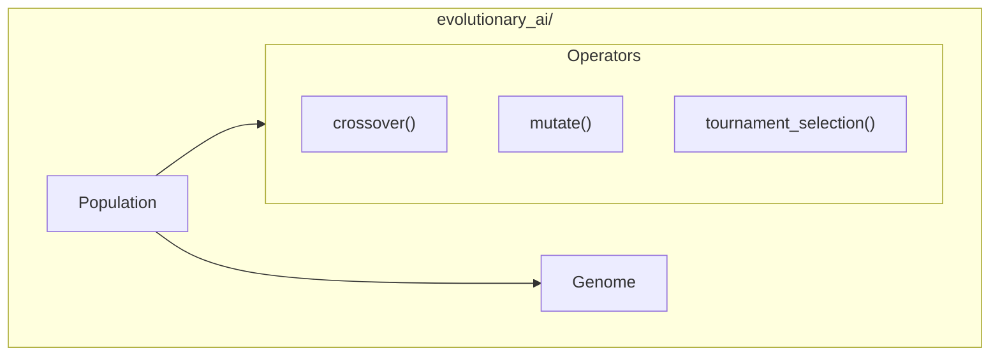

# Evolutionary AI Module

**Version**: v0.1.0 | **Status**: Active | **Last Updated**: January 2026

## Overview

The Evolutionary AI module provides genetic algorithm and evolutionary computation capabilities for the Codomyrmex platform, enabling optimization through evolution-inspired methods.

## Architecture



## Key Classes

| Class | Purpose |
|-------|---------|
| `Genome` | Individual genome representation |
| `Population` | Population of genomes |

## Operators

| Function | Purpose |
|----------|---------|
| `crossover()` | Combine two genomes |
| `mutate()` | Mutate a genome |
| `tournament_selection()` | Select best individuals |

## Quick Start

### Create Population

```python
from codomyrmex.evolutionary_ai import Population, Genome

# Define genome structure
def create_genome():
    return Genome(genes=[random.random() for _ in range(10)])

# Create population
population = Population(size=100, genome_factory=create_genome)
```

### Evolution Loop

```python
from codomyrmex.evolutionary_ai import (
    Population,
    crossover,
    mutate,
    tournament_selection
)

# Fitness function
def fitness(genome):
    return sum(genome.genes)

# Evolution loop
for generation in range(100):
    # Evaluate fitness
    population.evaluate(fitness)
    
    # Selection
    parents = tournament_selection(population, k=2)
    
    # Crossover
    offspring = crossover(parents[0], parents[1])
    
    # Mutation
    offspring = mutate(offspring, rate=0.01)
    
    # Update population
    population.replace_worst(offspring)
    
    print(f"Gen {generation}: Best = {population.best_fitness}")
```

### Custom Genome

```python
from codomyrmex.evolutionary_ai import Genome

class NeuralGenome(Genome):
    def __init__(self, layers):
        self.layers = layers
        self.weights = self._init_weights()
    
    def _init_weights(self):
        # Initialize neural network weights
        return [np.random.randn(l1, l2) 
                for l1, l2 in zip(self.layers[:-1], self.layers[1:])]
```

### Operators

```python
from codomyrmex.evolutionary_ai import crossover, mutate

# Single-point crossover
child = crossover(parent1, parent2, method="single_point")

# Uniform crossover
child = crossover(parent1, parent2, method="uniform")

# Gaussian mutation
mutated = mutate(genome, rate=0.1, sigma=0.5)
```

## Integration Points

- **cerebrum**: Neural architecture search
- **agents**: Agent evolution
- **coding**: Program synthesis

## Navigation

- **Parent**: [../README.md](../README.md)
- **Siblings**: [cerebrum](../cerebrum/), [agents](../agents/)
- **Spec**: [SPEC.md](SPEC.md)
