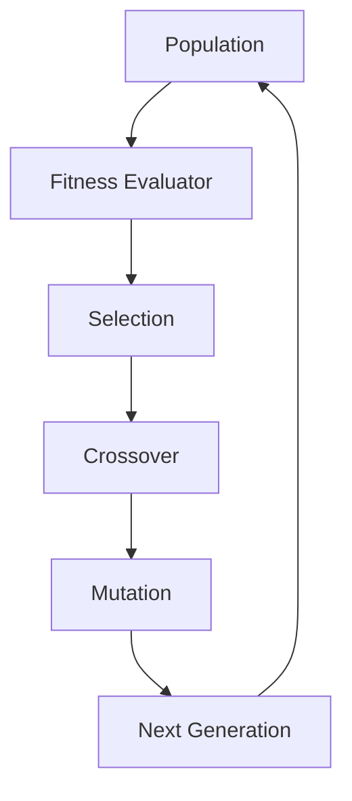

# evolutionary_ai - Functional Specification

## Purpose

To enable the discovery of optimal solutions in complex, non-differentiable search spaces through simulated Darwinian evolution.

## Design Principles

- **Modular Operators**: Easily swap mutation or selection methods.
- **Scalability**: Designed for massive populations across distributed environments.
- **Determinism**: Support for seeded random number generation for reproducible runs.
- **Abstraction**: Decouple the evolutionary core from the specific problem domain.

## Architecture

## Functional Requirements

- Define custom `Gene` types (binary, integer, float, or structured).
- Support multiple selection strategies (Tournament, Rank, Stochastic).
- Implement various crossover methods (Single-point, Two-point, Uniform).
- Support adaptive mutation rates.
- Maintain a 'Hall of Fame' for the best-performing individuals.

## Interface Contracts

### `Population`

- `evolve(fitness_scores: List[float])`
- `get_best_genome() -> Genome`
- `generations: int` (property)

### `Genome`

- `mutate(rate: float)`
- `copy() -> Genome`
- `random(length: int) -> Genome` (classmethod)

## Technical Constraints

- Computationally intensive for large populations and complex fitness functions.
- Highly dependent on high-quality random number generation.
