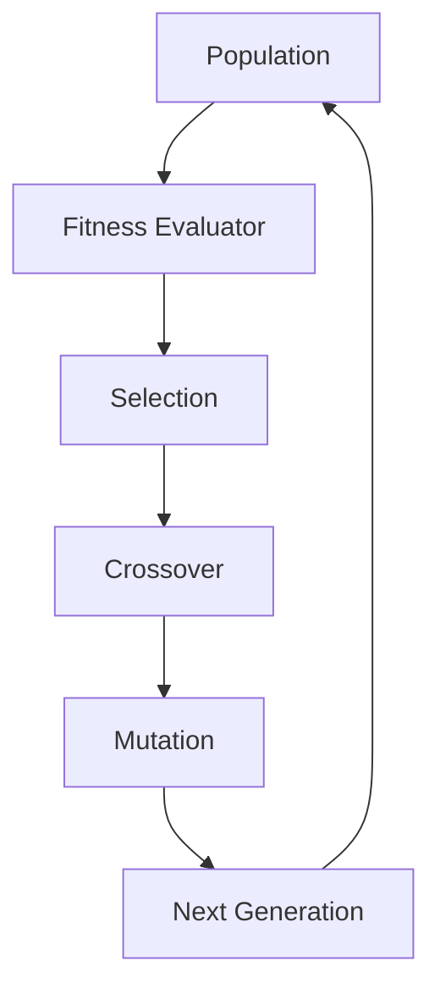

# evolutionary_ai - Functional Specification

**Version**: v1.1.4 | **Status**: Active | **Last Updated**: March 2026

## Purpose

To enable the discovery of optimal solutions in complex, non-differentiable search spaces through simulated Darwinian evolution.

## Design Principles

- **Modular Operators**: Easily swap mutation or selection methods.
- **Scalability**: Designed for massive populations across distributed environments.
- **Determinism**: Support for seeded random number generation for reproducible runs.
- **Abstraction**: Decouple the evolutionary core from the specific problem domain.

## Architecture


```mermaid
graph TD
    Pop[Population] --> Eval[Fitness Evaluator]
    Eval --> Sel[Selection]
    Sel --> Cross[Crossover]
    Cross --> Mut[Mutation]
    Mut --> Next[Next Generation]
    Next --> Pop
```

## Functional Requirements

- Define custom `Gene` types (binary, integer, float, or structured).
- Support multiple selection strategies (Tournament, Rank, Stochastic).
- Implement various crossover methods (Single-point, Two-point, Uniform, Blend).
- Support adaptive mutation rates and custom mutation operators.
- Maintain a 'Hall of Fame' for the best-performing individuals.

## Interface Contracts

### `Population`

- `evolve(selection_op: SelectionOperator[T], crossover_op: CrossoverOperator[T], mutation_op: MutationOperator[T], elitism: int)`
- `evaluate(fitness_fn: Callable[[Individual[T]], float])`
- `get_best() -> Individual[T]`
- `get_worst() -> Individual[T]`
- `is_converged(threshold: float, window: int) -> bool`
- `to_dict() -> dict[str, Any]`

### `Individual` / `Genome`

- `Individual(genes: T, fitness: float | None = None, metadata: dict[str, Any] | None = None)`
- `Genome.random(length: int, low: float, high: float) -> Genome` (classmethod)
- `Genome.distance(other: Genome) -> float`
- `Genome.stats() -> GenomeStats`
- `Genome.clamp(low: float, high: float) -> Genome`
- `Genome.clone() -> Genome`

### `FitnessFunction`

- `ScalarFitness(fn: Callable[[T], float], maximize: bool = True)`
- `MultiObjectiveFitness(objectives: list[Callable[[T], float]], maximize: list[bool])`
- `ConstrainedFitness(base: FitnessFunction, constraints: list[Callable[[T], float]], penalty_weight: float)`

## Technical Constraints

- Computationally intensive for large populations and complex fitness functions.
- Highly dependent on high-quality random number generation.

## Testing

The module is verified using strictly zero-mock tests to ensure actual evolutionary convergence and operator correctness.

```bash
uv run pytest src/codomyrmex/tests/unit/evolutionary_ai/
```
