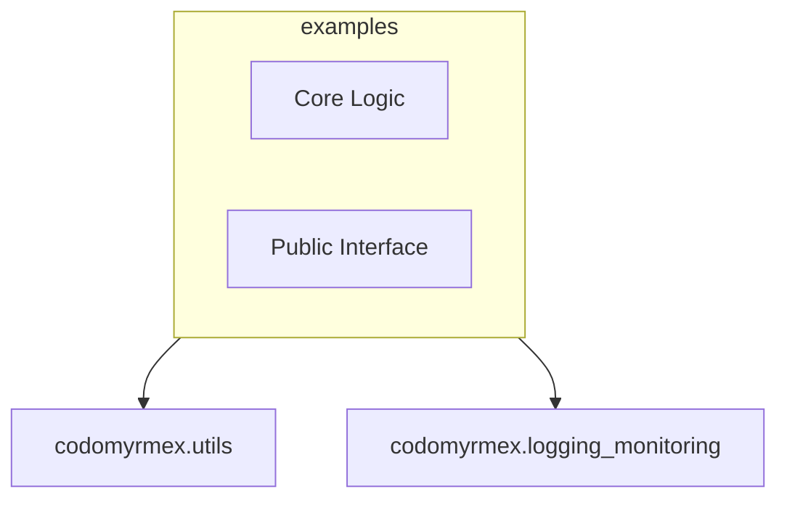

# Examples

**Version**: v0.1.0 | **Status**: Active

## Overview

Reference implementations, demonstrations, and validation reports showcasing Codomyrmex capabilities. Learning resource and advanced usage patterns reference.

## Architecture



## Components

- **Core**: Implementation logic.
- **API**: Exposed functions and classes.

## Usage

```python
from codomyrmex.examples import ...

# Example usage
# result = process(...)
```

## Navigation

- **Full Documentation**: [docs/modules/examples/](../../../docs/modules/examples/)
- **Parent**: [codomyrmex](../README.md)
- **Spec**: [SPEC.md](SPEC.md)
- **Agents**: [AGENTS.md](AGENTS.md)
