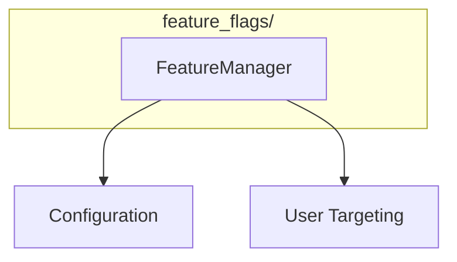

# Feature Flags Module

**Version**: v0.1.0 | **Status**: Active | **Last Updated**: January 2026

## Overview

The Feature Flags module provides feature toggle management for the Codomyrmex platform, enabling controlled rollout and A/B testing of features.

## Architecture



## Key Classes

| Class | Purpose |
|-------|---------|
| `FeatureManager` | Manage feature flags |

## Quick Start

### Basic Usage

```python
from codomyrmex.feature_flags import FeatureManager

flags = FeatureManager()

# Check if feature is enabled
if flags.is_enabled("new-dashboard"):
    show_new_dashboard()
else:
    show_old_dashboard()
```

### Define Features

```python
from codomyrmex.feature_flags import FeatureManager

flags = FeatureManager()

# Define features
flags.define("dark-mode", default=False)
flags.define("new-editor", default=True)
flags.define("beta-features", default=False)

# Enable for specific users
flags.enable_for_user("beta-features", user_id="user-123")
```

### Percentage Rollout

```python
from codomyrmex.feature_flags import FeatureManager

flags = FeatureManager()

# Gradual rollout
flags.set_percentage("new-feature", 25)  # 25% of users

# Check for specific user
if flags.is_enabled_for("new-feature", user_id=current_user.id):
    use_new_feature()
```

### Feature Configuration

```python
from codomyrmex.feature_flags import FeatureManager

flags = FeatureManager(config_file="features.yaml")

# YAML config:
# features:
#   new-dashboard:
#     enabled: true
#     percentage: 100
#   beta-editor:
#     enabled: true
#     percentage: 10
#     allowlist:
#       - admin
#       - beta-tester
```

## Integration Points

- **config_management**: Feature configuration
- **logging_monitoring**: Feature usage logging
- **auth**: User-based targeting

## Navigation

- **Parent**: [../README.md](../README.md)
- **Siblings**: [config_management](../config_management/), [auth](../auth/)
- **Spec**: [SPEC.md](SPEC.md)
