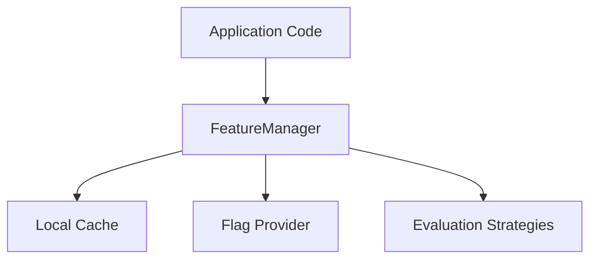

# feature_flags - Functional Specification

## Purpose

To provide a system for controlling functional and operational aspects of Codomyrmex at runtime, enabling gradual releases and rapid incident response.

## Design Principles

- **Resilience**: The system must fail 'closed' (to a safe default) if the flag provider is unreachable.
- **Low Latency**: Flag evaluations must be extremely fast to avoid impacting application performance.
- **Decoupling**: Business logic should not know how flag states are determined.
- **Flexibility**: Support for varied backend providers (Config, Database, Redis, LaunchDarkly, etc.).

## Architecture

## Functional Requirements

- Retrieve boolean flags based on a unique key.
- support multi-variate flags (returning strings or numbers).
- Target flags based on user attributes or environment variables.
- Gradually rollout features to a percentage of users.
- Remotely disable features in response to errors (Kill Switch).

## Interface Contracts

### `FeatureManager`

- `is_enabled(flag_key: str, **context) -> bool`
- `get_value(flag_key: str, **context) -> Any`
- `load_from_file(path: str)`
- `save_to_file(path: str)`

## Technical Constraints

- Must integration with the `cache` or `persistence` layer for performance.
- Dependent on the `telemetry` module for tracking flag usage metrics.
