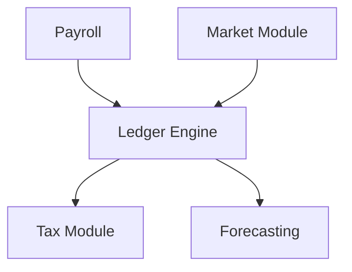

# Finance - Functional Specification

**Version**: v0.1.7 | **Status**: Active | **Last Updated**: February 2026

## Purpose

Provide a robust, audit-ready financial system for AI agents to manage economic activities, track value flow, and ensure compliance.

## Design Principles

### Integrity

- Double-entry accounting for all transactions
- Immutable transaction logs
- Cryptographic verification of ledger state

### Compliance

- Built-in tax estimation logic
- Regulatory reporting formats

## Architecture

## Functional Requirements

1. **Ledger**: Record debit/credit pairs with atomic consistency.
2. **Taxes**: Estimate tax obligations based on jurisdictional rules.
3. **Payroll**: Manage recurring payments to agents and humans.
4. **Forecasting**: Project runway based on spending patterns.

## Interface Contracts

- `Ledger.record(transaction)`
- `TaxEstimator.calculate(income, jurisdiction)`
- `Forecaster.predict_cashflow(months)`

## Navigation

- [README](README.md) | [AGENTS](AGENTS.md) | [Parent](../SPEC.md)
