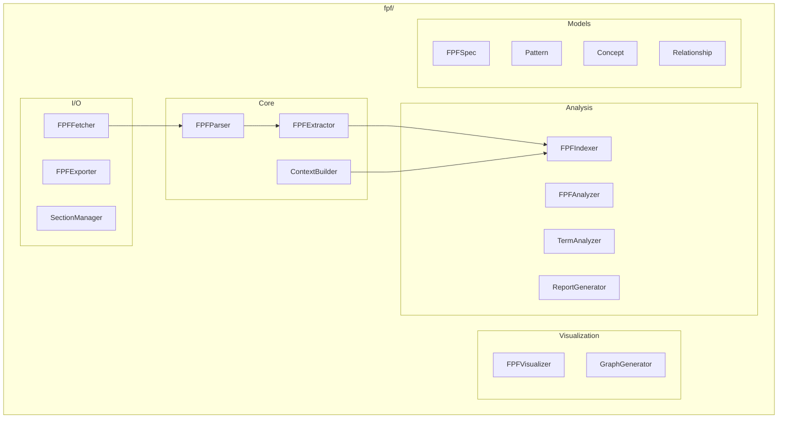

# FPF Module (First Principles Framework)

**Version**: v0.1.0 | **Status**: Active | **Last Updated**: January 2026

## Overview

The FPF (First Principles Framework) module provides functionality to fetch, parse, analyze, and export the First Principles Framework specification for use in prompt and context engineering.

## Architecture



## Key Classes

| Class | Purpose |
|-------|---------|
| `FPFParser` | Parse FPF specifications |
| `FPFExtractor` | Extract concepts/relationships |
| `FPFIndexer` | Build searchable index |
| `FPFFetcher` | Fetch from GitHub |
| `FPFExporter` | Export to JSON |
| `ContextBuilder` | Build prompt context |
| `FPFAnalyzer` | Analyze specifications |
| `FPFVisualizer` | Visualize structures |
| `ReportGenerator` | Generate reports |

## Models

| Model | Purpose |
|-------|---------|
| `FPFSpec` | Full specification |
| `Pattern` | Pattern definition |
| `Concept` | Concept definition |
| `Relationship` | Relationship between concepts |
| `FPFIndex` | Searchable index |

## Quick Start

### Load and Parse

```python
from codomyrmex.fpf import FPFParser, FPFExtractor

parser = FPFParser()
spec = parser.parse_spec(open("FPF-Spec.md").read())

extractor = FPFExtractor()
spec.concepts = extractor.extract_concepts(spec)
spec.relationships = extractor.extract_relationships(spec)
```

### Fetch from GitHub

```python
from codomyrmex.fpf import FPFFetcher, FPFParser

fetcher = FPFFetcher()
content = fetcher.fetch_latest(repo="ailev/FPF", branch="main")

parser = FPFParser()
spec = parser.parse_spec(content)
```

### Search Patterns

```python
from codomyrmex.fpf import FPFIndexer

indexer = FPFIndexer()
indexer.build_index(spec)

patterns = indexer.search_patterns("prompt engineering")
for pattern in patterns:
    print(f"{pattern.id}: {pattern.name}")
```

### Build Context

```python
from codomyrmex.fpf import ContextBuilder

builder = ContextBuilder(spec)

# Full context
context = builder.build_full_context()

# Pattern-specific context
context = builder.build_context_for_pattern("pattern-123")
```

### Export

```python
from codomyrmex.fpf import FPFExporter

exporter = FPFExporter()
exporter.export_json(spec, "fpf-export.json")
```

## Integration Points

- **llm**: Context for prompts
- **cerebrum**: Knowledge integration
- **agents**: Agent reasoning

## Navigation

- **Parent**: [../README.md](../README.md)
- **Siblings**: [cerebrum](../cerebrum/), [llm](../llm/)
- **Spec**: [SPEC.md](SPEC.md)
