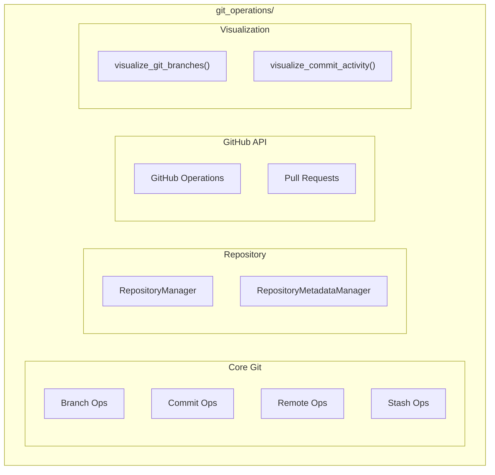

# Git Operations Module

**Version**: v0.1.0 | **Status**: Active | **Last Updated**: January 2026

## Overview

The Git Operations module provides a standardized interface and tools for performing Git actions programmatically within the Codomyrmex ecosystem. It includes core Git commands, repository management, GitHub API integration, and visualization capabilities.

## Architecture



## Core Git Functions

### Repository

| Function | Purpose |
|----------|---------|
| `check_git_availability()` | Check git is installed |
| `is_git_repository()` | Check if path is git repo |
| `initialize_git_repository()` | Init new repo |
| `clone_repository()` | Clone remote repo |

### Branch Operations

| Function | Purpose |
|----------|---------|
| `create_branch()` | Create branch |
| `switch_branch()` | Switch branch |
| `get_current_branch()` | Get current branch |
| `merge_branch()` | Merge branch |
| `rebase_branch()` | Rebase branch |

### Commit Operations

| Function | Purpose |
|----------|---------|
| `add_files()` | Stage files |
| `commit_changes()` | Commit staged |
| `amend_commit()` | Amend last commit |
| `get_status()` | Get status |
| `get_diff()` | Get diff |
| `cherry_pick()` | Cherry pick commit |

### Remote Operations

| Function | Purpose |
|----------|---------|
| `push_changes()` | Push to remote |
| `pull_changes()` | Pull from remote |
| `fetch_changes()` | Fetch from remote |
| `add_remote()` | Add remote |
| `list_remotes()` | List remotes |

## Quick Start

### Basic Git Operations

```python
from codomyrmex.git_operations import (
    clone_repository,
    create_branch,
    add_files,
    commit_changes,
    push_changes
)

# Clone
clone_repository("https://github.com/user/repo.git", "./repo")

# Create branch and commit
create_branch("feature-x")
add_files(["src/new_file.py"])
commit_changes("Add new feature")
push_changes()
```

### Repository Management

```python
from codomyrmex.git_operations import RepositoryManager, Repository

manager = RepositoryManager()

# Register repositories
manager.add(Repository(
    name="main-app",
    path="./main-app",
    remote="https://github.com/org/main-app.git"
))

# Sync all
manager.sync_all()
```

### GitHub API

```python
from codomyrmex.git_operations import (
    create_github_repository,
    create_pull_request,
    get_pull_requests
)

# Create repo
create_github_repository(
    name="new-project",
    description="My new project",
    private=True
)

# Create PR
pr = create_pull_request(
    repo="org/repo",
    title="Feature: Add new capability",
    head="feature-x",
    base="main"
)

# List PRs
prs = get_pull_requests("org/repo", state="open")
```

### Visualization (Optional)

```python
from codomyrmex.git_operations import (
    visualize_git_branches,
    visualize_commit_activity,
    create_git_analysis_report
)

# Branch diagram
visualize_git_branches("./repo", output="branches.svg")

# Commit activity
visualize_commit_activity("./repo", period="30d")

# Full analysis
report = create_git_analysis_report("./repo")
```

## Key Classes

| Class | Purpose |
|-------|---------|
| `RepositoryManager` | Manage multiple repos |
| `Repository` | Repository definition |
| `RepositoryType` | Repo type enum |
| `RepositoryMetadataManager` | Metadata management |
| `RepositoryMetadata` | Repo metadata |
| `CloneStatus` | Clone status enum |

## Integration Points

- **ci_cd_automation**: Git-triggered pipelines
- **agents**: Agent git operations
- **logging_monitoring**: Git operation logging

## Navigation

- **Parent**: [../README.md](../README.md)
- **Siblings**: [ci_cd_automation](../ci_cd_automation/), [coding](../coding/)
- **Spec**: [SPEC.md](SPEC.md)
