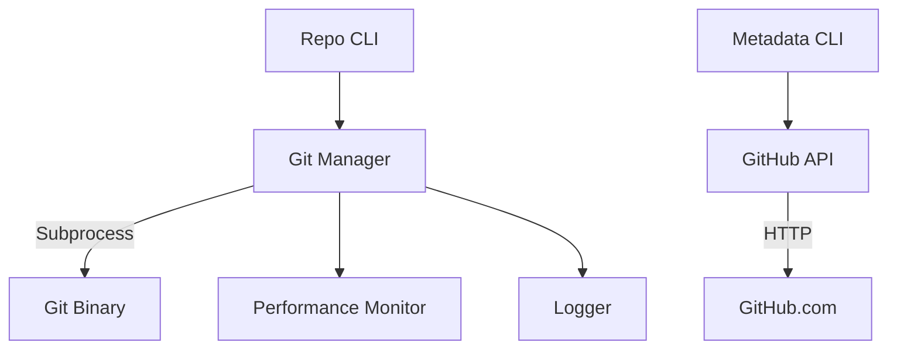

# git_operations - Functional Specification

**Version**: v0.1.0 | **Status**: Active | **Last Updated**: February 2026

## Purpose

The `git_operations` module provides a programmatic Python interface for Git interactions. It abstracts raw `subprocess` calls into typed, error-handling functions for initializing, managing, and synchronizing repositories. It is the foundation for automated code modification and version control within Codomyrmex.

## Design Principles

### Modularity

- **Wrapper Pattern**: Functions wrap specific `git` commands (e.g., `git_manager.py` wraps CLI verbs).
- **Backend Agnostic**: Currently uses `subprocess`, but the API `clone_repository`, `commit_changes` is stable regardless of implementation (e.g., could switch to `gitpython` or `libgit2` later).

### Internal Coherence

- **Error Handling**: All functions catch `subprocess.CalledProcessError` and return typed results or booleans, logging errors via `logging_monitoring`.
- **Performance**: Decorated with `@monitor_performance` to track `subprocess` latency.

### Functionality

- **Automated workflows**: Enables "agentic" git usage (creating branches, committing specific files, pushing).

## Architecture



## Functional Requirements

### Core Capabilities

1. **Lifecycle**: `initialize`, `clone`.
2. **Worktree**: `add_files`, `stash`, `apply_stash`.
3. **History**: `commit_changes`, `get_commit_history`.
4. **Branching**: `create_branch`, `switch_branch`, `merge_branch`, `rebase_branch`.
5. **Remote**: `push_changes`, `pull_changes`.
6. **State**: `get_status`, `is_git_repository`.

### Quality Standards

- **Wait and Retry**: Network operations (clone, push) should be robust.
- **Safety**: Functions defaulting to `cwd` must be used carefully; explicit paths preferred.

## Interface Contracts

### Public API

The module exports 40+ functions covering all Git operations. Key examples:
- `git_manager.clone_repository(url: str, dest: str, branch: str = None) -> bool`
- `git_manager.commit_changes(message: str, repository_path: str = None, ...) -> Optional[str]`
- `git_manager.create_branch(branch_name: str, repository_path: str = None) -> bool`
- `git_manager.get_status(repository_path: str = None) -> dict[str, Any]`
- `git_manager.get_commit_history(limit: int = 10, repository_path: str = None) -> list[dict]`

See [API_SPECIFICATION.md](API_SPECIFICATION.md) and [COMPLETE_API_DOCUMENTATION.md](docs/COMPLETE_API_DOCUMENTATION.md) for complete function list.

### Dependencies

- **System**: `git` executable must be in PATH.
- **Internal**: `logging_monitoring`, `performance`.

## Navigation

- **Human Documentation**: [README.md](README.md)
- **Technical Documentation**: [AGENTS.md](AGENTS.md)
- **Package SPEC**: [../SPEC.md](../SPEC.md)

<!-- Navigation Links keyword for score -->

## Testing

```bash
uv run python -m pytest src/codomyrmex/tests/ -k git_operations -v
```
