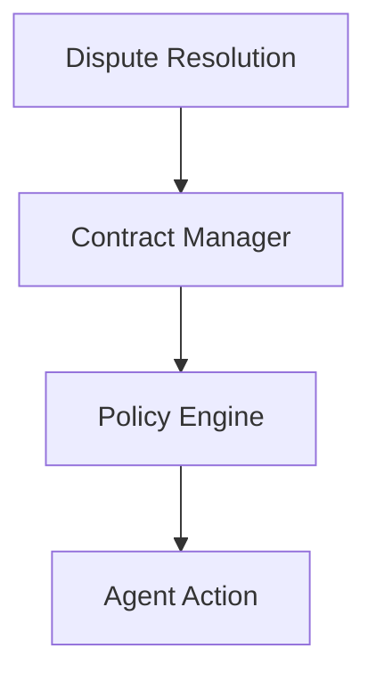

# Governance - Functional Specification

**Version**: v0.1.0 | **Status**: Active | **Last Updated**: February 2026

## Purpose

Establish a rule of law for agents, ensuring their actions comply with user-defined policies and contractual obligations.

## Design Principles

### Explicit Rules

- Policies are defined as code, not vague instructions
- Contracts have machine-readable terms

### Conflict Resolution

- Deterministic arbitration for resource contention
- Escalation paths for ambiguous situations

## Architecture

## Functional Requirements

1. **Contracts**: Generate and validate service agreements.
2. **Policy**: Intercept agent actions to ensure compliance.
3. **Dispute Resolution**: Automated mediation between agents.

## Interface Contracts

- `Policy.check(action_context)`
- `Contract.validate_terms()`
- `Arbitrator.resolve(dispute)`

## Navigation

- [README](README.md) | [AGENTS](AGENTS.md) | [Parent](../SPEC.md)
