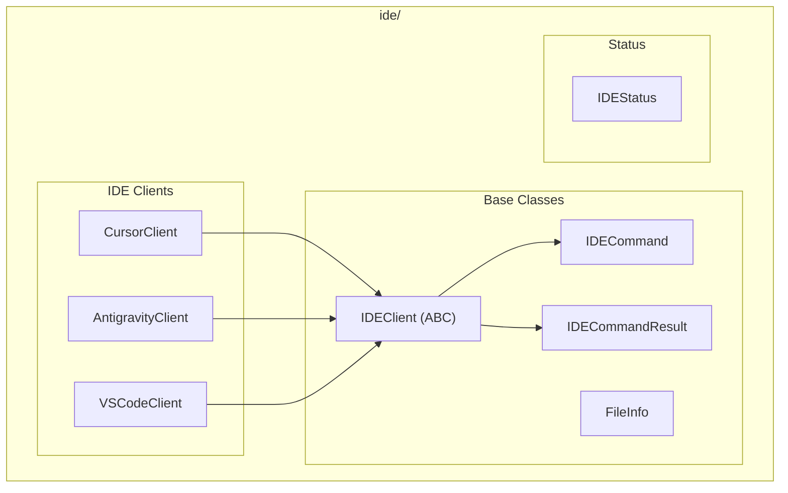

# IDE Module

**Version**: v0.1.0 | **Status**: Active | **Last Updated**: January 2026

## Overview

The IDE module provides programmatic integration and automation capabilities for various Integrated Development Environments. It enables AI agents to achieve maximum agentic operation of IDEs, allowing sophisticated control and automation of development workflows.

## Supported IDEs

- **Antigravity**: Google DeepMind's Antigravity IDE
- **Cursor**: AI-first code editor
- **VS Code**: Visual Studio Code

## Architecture



## Key Classes

| Class | Purpose |
|-------|---------|
| `IDEClient` | Abstract base for IDE integrations |
| `IDECommand` | Command to execute |
| `IDECommandResult` | Command execution result |
| `IDEStatus` | Connection status enum |
| `FileInfo` | File information container |
| `CursorClient` | Cursor IDE client |

## IDEStatus Values

| Status | Description |
|--------|-------------|
| `DISCONNECTED` | Not connected |
| `CONNECTING` | Connection in progress |
| `CONNECTED` | Successfully connected |
| `ERROR` | Connection error |

## Quick Start

### Connect to IDE

```python
from codomyrmex.ide import CursorClient, IDEStatus

client = CursorClient()

if client.connect():
    print(f"Status: {client.status}")
    print(f"Open files: {client.get_open_files()}")
```

### Execute Commands

```python
from codomyrmex.ide import CursorClient, IDECommand

client = CursorClient()
client.connect()

# Execute single command
result = client.execute_command("editor.formatDocument")

# Safe execution with timing
result = client.execute_command_safe("editor.save", timeout=5.0)
print(f"Success: {result.success}, Time: {result.execution_time}s")
```

### Batch Commands

```python
from codomyrmex.ide import IDECommand

commands = [
    IDECommand(name="editor.selectAll"),
    IDECommand(name="editor.formatDocument"),
    IDECommand(name="workbench.action.files.save"),
]

results = client.execute_batch(commands, stop_on_error=True)
```

### File Operations

```python
# Get active file
active = client.get_active_file()
print(f"Editing: {active}")

# Open a file
client.open_file("src/main.py")

# Get file info
info = client.get_file_info("src/main.py")
print(f"{info.name}: {info.line_count} lines, {info.language}")
```

### Event Handling

```python
def on_file_change(data):
    print(f"File changed: {data}")

client.register_event_handler("fileChange", on_file_change)
```

## Exceptions

| Exception | When Raised |
|-----------|-------------|
| `IDEError` | Base IDE exception |
| `ConnectionError` | Connection failure |
| `CommandExecutionError` | Command execution failure |
| `SessionError` | Session error |
| `ArtifactError` | Artifact operation failure |

## Integration Points

- **agents**: IDE automation for AI agents
- **coding**: Code execution and testing
- **static_analysis**: Code analysis integration

## Navigation

- **Parent**: [../README.md](../README.md)
- **Siblings**: [agents](../agents/), [coding](../coding/)
- **Spec**: [SPEC.md](SPEC.md)
