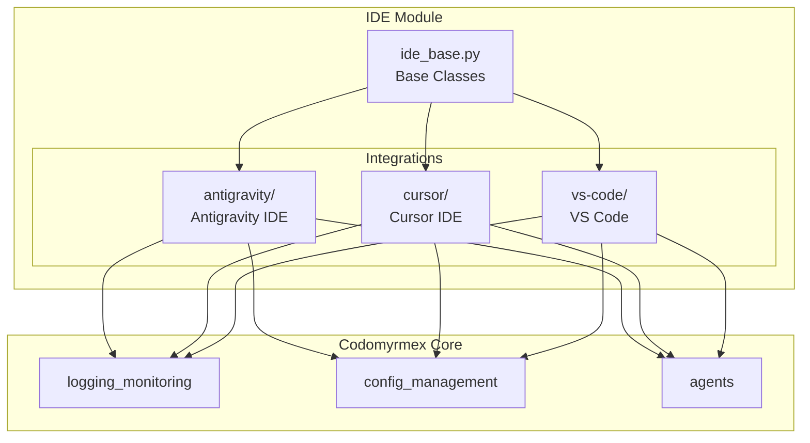

# ide - Functional Specification

**Version**: v1.0.0 | **Status**: Active | **Last Updated**: February 2026

## Purpose

The IDE module provides programmatic integration and automation capabilities for various Integrated Development Environments. This enables AI agents to achieve maximum agentic operation of IDEs themselves, allowing sophisticated control and automation of development workflows.

## Design Principles

### Modularity

- Each IDE integration is self-contained in its own submodule
- Common functionality abstracted to base classes
- Clear interfaces between IDE-specific and generic code

### Internal Coherence

- Consistent API patterns across all IDE integrations
- Unified error handling and logging
- Standardized configuration management

### Parsimony

- Minimal dependencies per integration
- Lean implementations focused on essential functionality
- Efficient resource usage

### Functionality

- Real, working integrations (no mocks)
- Comprehensive IDE control capabilities
- Production-ready implementations

### Testing

- Unit tests for each integration
- Integration tests with actual IDE instances where possible
- Mocked external services only when unavoidable

### Documentation

- Complete API documentation
- Usage examples for each integration
- Integration guides and tutorials

## Architecture



## Functional Requirements

### Core IDE Operations

1. **Connection Management**: Connect to and manage IDE instances
2. **File Operations**: Create, read, update, delete files via IDE
3. **Editor Control**: Navigate, select, edit text in editors
4. **Terminal Integration**: Execute commands in integrated terminals
5. **Extension Management**: List, enable, disable extensions

### Antigravity-Specific

1. **Task Boundaries**: Manage task state and boundaries
2. **Artifact Management**: Create and manage artifacts
3. **Browser Automation**: Control embedded browser
4. **Tool Invocation**: Call Antigravity tools programmatically

### Cursor-Specific

1. **Composer Automation**: Automate Cursor Composer
2. **Rule Management**: Manage .cursorrules files
3. **Model Configuration**: Configure AI model settings
4. **Chat Integration**: Interact with Cursor chat

### VS Code-Specific

1. **Command Execution**: Execute VS Code commands
2. **Workspace Management**: Manage workspaces and settings
3. **Debug Control**: Start, stop, manage debug sessions
4. **Task Automation**: Run and manage VS Code tasks

## Interface Contracts

### IDEClient Base Class

```python
class IDEClient(ABC):
    @abstractmethod
    def connect(self) -> bool: ...
    
    @abstractmethod
    def disconnect(self) -> None: ...
    
    @abstractmethod
    def get_capabilities(self) -> dict: ...
    
    @abstractmethod
    def execute_command(self, command: str, args: dict = None) -> Any: ...
    
    @abstractmethod
    def get_active_file(self) -> Optional[str]: ...
    
    @abstractmethod
    def open_file(self, path: str) -> bool: ...
```

## Quality Standards

### Code Quality

- Type hints on all public APIs
- Docstrings following Google style
- Comprehensive error handling
- Logging at appropriate levels

### Testing Requirements

- ≥80% code coverage
- Unit tests for all public methods
- Integration tests where feasible
- Performance benchmarks for critical paths

## Navigation

- **Human Documentation**: [README.md](README.md)
- **Technical Documentation**: [AGENTS.md](AGENTS.md)
- **Repository Root**: [../../../README.md](../../../README.md)
- **Repository SPEC**: [../../../SPEC.md](../../../SPEC.md)

<!-- Navigation Links keyword for score -->
