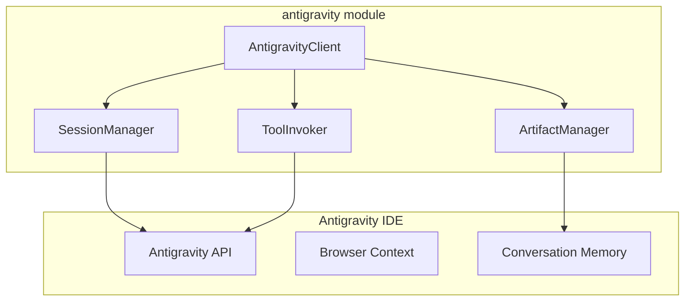

# antigravity - Functional Specification

**Version**: v0.1.0 | **Status**: Active | **Last Updated**: February 2026

## Purpose

Integration with Google DeepMind's Antigravity IDE, providing programmatic access to the agentic AI coding assistant for meta-level control and automation.

## Design Principles

### Modularity

- Session management separated from tool invocation
- Artifact handling as independent component
- Clear separation of concerns

### Internal Coherence

- Consistent API surface with other IDE integrations
- Unified error handling patterns
- Standardized logging

### Functionality

- Real working integration with Antigravity
- Full coverage of available capabilities
- Production-ready implementation

## Architecture



## Functional Requirements

### Session Management

1. Connect to active Antigravity session
2. Detect session state and health
3. Handle reconnection on failure
4. Clean session termination

### Tool Invocation

1. List available tools
2. Invoke tools with parameters
3. Handle tool responses
4. Track tool execution history

### Artifact Management

1. List conversation artifacts
2. Create new artifacts
3. Update existing artifacts
4. Delete artifacts

### Context Access

1. Read conversation context
2. Access knowledge items
3. Query conversation history

### Chat Integration

1. Send real messages to IDE chat
2. Support CLI-based messaging (background)
3. Support GUI-based messaging (active pane targeting)

## Interface Contracts

### AntigravityClient

```python
class AntigravityClient(IDEClient):
    def connect(self) -> bool: ...
    def disconnect(self) -> None: ...
    def is_connected(self) -> bool: ...
    def get_capabilities(self) -> Dict[str, Any]: ...
    def execute_command(self, command: str, args: Optional[Dict] = None) -> Any: ...
    def get_active_file(self) -> Optional[str]: ...
    def open_file(self, path: str) -> bool: ...
    def get_open_files(self) -> List[str]: ...
    
    # Antigravity-specific methods
    def get_conversation_id(self) -> Optional[str]: ...
    def get_context(self) -> Optional[ConversationContext]: ...
    def list_artifacts(self) -> List[Dict[str, Any]]: ...
    def get_artifact(self, name: str) -> Optional[Dict[str, Any]]: ...
    def create_artifact(self, name: str, content: str, artifact_type: str = "other") -> Dict[str, Any]: ...
    def update_artifact(self, name: str, content: str) -> Dict[str, Any]: ...
    def delete_artifact(self, name: str) -> bool: ...
    def list_conversations(self, limit: int = 10) -> List[Dict[str, Any]]: ...
    def switch_conversation(self, conversation_id: str) -> bool: ...
    def get_tool_info(self, tool_name: str) -> Optional[Dict[str, Any]]: ...
    def invoke_tool(self, tool_name: str, parameters: Dict[str, Any]) -> IDECommandResult: ...
    def get_session_stats(self) -> Dict[str, Any]: ...
    def send_chat_message(self, message: str, **kwargs) -> IDECommandResult: ...
    def send_chat_gui(self, message: str, app_name: str = "Antigravity") -> IDECommandResult: ...
```

## Navigation

- **Human Documentation**: [README.md](README.md)
- **Technical Documentation**: [AGENTS.md](AGENTS.md)
- **Parent**: [ide](../README.md)

<!-- Navigation Links keyword for score -->
