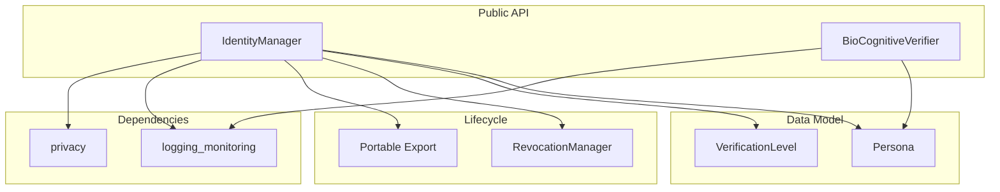

# identity - Functional Specification

**Version**: v0.1.0 | **Status**: Active | **Last Updated**: February 2026

## Purpose

The `identity` module provides multi-persona management and bio-cognitive verification for Secure Cognitive Agents. It allows agents to maintain distinct, verifiable identities (Personas) across a 3-tier trust model (KYC, Verified Anon, Anon) while preserving pseudonymity through behavioral biometric verification.

## Design Principles

### Modularity

- Persona management decoupled from verification engine
- Pluggable verification backends (keystroke dynamics, behavioral patterns)
- Clean separation between identity lifecycle and authentication

### Internal Coherence

- Consistent verification levels across all persona operations
- Unified persona data model with portable export format
- Integration with wallet, defense, and privacy modules

### Parsimony

- Minimal persona attributes — only what's needed per tier
- Lightweight verification that doesn't require external services
- Simple API for common identity operations

### Functionality

- 3-tier persona management (Blue/Grey/Black corresponding to KYC/Verified Anon/Anon)
- Bio-cognitive verification via behavioral biometrics
- Persona lifecycle: create, switch, revoke, export
- Credential revocation handling

### Testing

- Unit tests for persona CRUD operations
- Verification accuracy benchmarks
- Tier boundary enforcement tests

### Documentation

- Complete API specifications
- Persona tier reference
- Verification integration guide

## Architecture



## Functional Requirements

### Core Capabilities

1. **Persona Creation**: Create personas with specified verification tier via `IdentityManager.create_persona()`
2. **Context Switching**: Switch active persona for agent operations via `IdentityManager.set_active_persona()`
3. **Bio-Cognitive Verification**: Authenticate users via behavioral biometrics (keystroke dynamics) via `BioCognitiveVerifier.verify()`
4. **Persona Revocation**: Invalidate compromised personas via `RevocationManager`
5. **Portable Export**: Export persona claims in a portable format

### Integration Points

- `wallet/` - Persona-linked key management
- `defense/` - Persona-aware threat detection
- `privacy/` - Scrub identity metadata from communications
- `logging_monitoring/` - Identity operation logging (never log persona mappings)

## Quality Standards

### Code Quality

- Type hints for all functions
- PEP 8 compliance
- Privacy-preserving logging (no persona mappings in logs)

### Testing Standards

- ≥80% coverage
- Tier enforcement boundary tests
- Verification accuracy benchmarks

### Documentation Standards

- README.md, AGENTS.md, SPEC.md
- Verification tier reference
- Persona lifecycle documentation

## Interface Contracts

### IdentityManager API

```python
class IdentityManager:
    def create_persona(id: str, name: str, level: VerificationLevel) -> Persona
    def set_active_persona(id: str) -> None
    @property
    def active_persona() -> Optional[Persona]
    def revoke_persona(id: str) -> bool
    def export_persona(id: str) -> dict
    def list_personas() -> List[Persona]
```

### BioCognitiveVerifier API

```python
class BioCognitiveVerifier:
    def verify(user_id: str, metric: str, current_value: float) -> bool
    def enroll(user_id: str, metric_type: str, baseline: List[float]) -> None
    def get_confidence(user_id: str) -> float
    def record_metric(user_id: str, metric: str, value: float) -> None
```

### Identity API

```python
class Identity:
    def process(data: Any) -> Any
```

### Dependencies

- **Internal**: `codomyrmex.logging_monitoring`, `codomyrmex.privacy`.

## Implementation Guidelines

### Persona Management

1. Enforce tier-appropriate attribute requirements
2. Never expose persona-to-user mappings in logs
3. Support graceful degradation when verification service is unavailable

### Verification

1. Collect behavioral baselines during enrollment
2. Statistical comparison against enrolled patterns
3. Confidence scoring with configurable thresholds

## Navigation

- **Human Documentation**: [README.md](README.md)
- **Technical Documentation**: [AGENTS.md](AGENTS.md)
- **Package SPEC**: [../SPEC.md](../SPEC.md)
