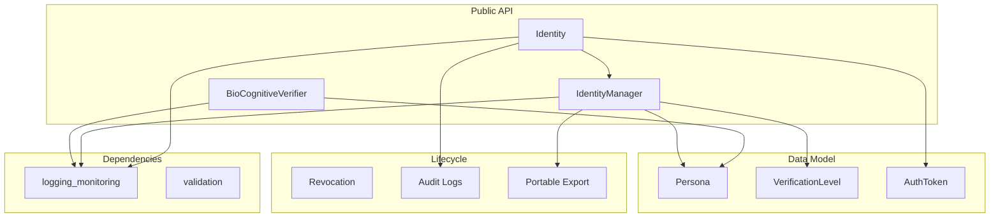

# identity - Functional Specification

**Version**: v1.1.4 | **Status**: Active | **Last Updated**: March 2026

## Purpose

The `identity` module provides multi-persona management and bio-cognitive verification for Secure Cognitive Agents. It allows agents to maintain distinct, verifiable identities (Personas) across a 3-tier trust model (KYC, Verified Anon, Anon) while preserving pseudonymity through behavioral biometric verification.

## Design Principles

### Modularity

- Persona management decoupled from verification engine
- Pluggable verification backends (keystroke dynamics, behavioral patterns)
- Clean separation between identity lifecycle and session authentication

### Internal Coherence

- Consistent verification levels across all persona operations
- Unified persona data model with portable `to_dict` export format
- Integration with logging, monitoring, and validation subsystems

### Parsimony

- Minimal persona attributes — only what's needed per tier
- Lightweight statistical verification that doesn't require external services
- Simple API for common identity operations (create, switch, promote)

### Functionality

- 3-tier persona management (Blue/Grey/Black corresponding to KYC/Verified Anon/Anon)
- Bio-cognitive verification via behavioral biometrics (Z-score based)
- Persona lifecycle: create, switch, promote, revoke, export
- Authentication session management with TTL and refresh
- Audit logging of all identity-related events

### Testing

- Zero-mock unit tests for all persona and verification operations
- Statistical accuracy tests for bio-cognitive outliers
- Tier boundary and capability enforcement tests

### Documentation

- Complete API specifications
- Persona tier reference (Blue/Grey/Black)
- Verification integration guide

## Architecture


```mermaid
graph TD
    subgraph "Public API"
        ID[Identity]
        IM[IdentityManager]
        BCV[BioCognitiveVerifier]
    end

    subgraph "Data Model"
        P[Persona]
        VL[VerificationLevel]
        AT[AuthToken]
    end

    subgraph "Lifecycle"
        RM[Revocation]
        Audit[Audit Logs]
        Export[Portable Export]
    end

    subgraph "Dependencies"
        LOG[logging_monitoring]
        VALID[validation]
    end

    ID --> IM
    IM --> P
    IM --> VL
    ID --> AT
    ID --> Audit
    IM --> Export
    BCV --> P
    BCV --> LOG
    IM --> LOG
    ID --> LOG
```

## Functional Requirements

### Core Capabilities

1. **Persona Management**: Create, list, promote, and revoke personas via `IdentityManager`.
2. **Context Switching**: Switch the active persona context for agent operations via `IdentityManager.set_active_persona()`.
3. **Bio-Cognitive Verification**: Authenticate users via behavioral biometrics (Z-score based) via `BioCognitiveVerifier.verify()`.
4. **Session Management**: Issue and validate session tokens with expiry and refresh via `Identity`.
5. **Audit Logging**: Record all login, logout, and verification events via `Identity._audit()`.
6. **Data Processing**: Identity-aware data processing through `Identity.process()`.

### Integration Points

- `logging_monitoring/` - Identity operation logging (never log persona-to-user mappings).
- `validation/` - Input and schema validation for identity objects.

## Interface Contracts

### IdentityManager API

```python
class IdentityManager:
    def create_persona(id: str, name: str, level: VerificationLevel, capabilities: List[str] = None) -> Persona
    def register_persona(persona: Persona) -> None
    def set_active_persona(id: str) -> None
    @property
    def active_persona() -> Optional[Persona]
    def revoke_persona(id: str) -> bool
    def export_persona(id: str) -> dict
    def list_personas(level: VerificationLevel = None) -> List[Persona]
    def promote_persona(id: str, new_level: VerificationLevel) -> bool
```

### BioCognitiveVerifier API

```python
class BioCognitiveVerifier:
    def verify(user_id: str, metric: str, current_value: float) -> bool
    def enroll(user_id: str, metric_type: str, baseline: List[float]) -> None
    def get_confidence(user_id: str) -> float
    def record_metric(user_id: str, metric: str, value: float) -> None
    def create_challenge(persona: Persona) -> dict
```

### Identity API

```python
class Identity:
    def login(user_id: str, credentials: dict, provider: str, scopes: List[str]) -> Optional[AuthToken]
    def logout(token_str: str) -> bool
    def validate_token(token_str: str) -> bool
    def refresh_token(token_str: str) -> Optional[AuthToken]
    def process(data: Any) -> Any
    @property
    def manager() -> IdentityManager
    @property
    def audit_log() -> List[AuthEvent]
```

### Dependencies

- **Internal**: `codomyrmex.logging_monitoring`.

## Implementation Guidelines

### Persona Management

1. Enforce tier-appropriate attribute requirements (KYC vs Anon).
2. Never expose persona-to-user mappings in logs or audit events.
3. Personas are immutable in ID but mutable in level and attributes.

### Verification

1. Collect behavioral baselines (minimum 10-20 samples) during enrollment or training.
2. Use Z-score analysis (mean, std) for comparison against enrolled patterns.
3. Reject samples with Z-score > 2.5 (98.8% confidence interval).
4. Adapt to gradual behavioral drift by using a sliding window (last 100 samples).

## Navigation

- **Human Documentation**: [README.md](README.md)
- **Technical Documentation**: [AGENTS.md](AGENTS.md)
- **Package SPEC**: [../SPEC.md](../SPEC.md)
