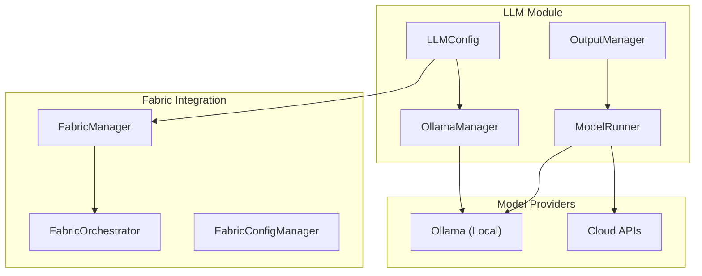

# Personal AI Infrastructure — LLM Module

**Version**: v1.0.0 | **Status**: Active | **Last Updated**: February 2026

## Overview

The LLM module provides the foundation for Personal AI Infrastructure model integration. It supports local model execution via Ollama and Fabric, enabling privacy-focused AI development workflows.

## PAI Capabilities

### Local Model Execution

Run AI models locally for privacy and cost control:

```python
from codomyrmex.llm import OllamaManager, ModelRunner

# Initialize Ollama manager
manager = OllamaManager()

# Check available models
models = manager.list_models()

# Pull a model if needed
manager.pull_model("codellama:13b")

# Run inference
runner = ModelRunner(model="codellama:13b")
response = runner.generate(
    prompt="Explain this Python function",
    context=code_snippet
)
```

### Fabric Integration

Use Fabric patterns for structured AI workflows:

```python
from codomyrmex.llm import FabricManager, FabricOrchestrator

# Initialize Fabric
fabric = FabricManager()

# List available patterns
patterns = fabric.list_patterns()

# Run a pattern
orchestrator = FabricOrchestrator()
result = orchestrator.run_pattern(
    pattern="improve_code",
    input_text=code_to_improve
)
```

### Configuration Management

Centralized LLM configuration:

```python
from codomyrmex.llm import LLMConfig, LLMConfigPresets

# Use presets
config = LLMConfigPresets.fast_local()  # Fast local model
config = LLMConfigPresets.quality_cloud()  # High quality cloud

# Custom configuration
config = LLMConfig(
    provider="ollama",
    model="codellama:13b",
    temperature=0.3,
    max_tokens=2048,
    context_window=4096
)
```

## PAI Architecture



## Local-First AI

### Why Local-First?

| Benefit | Description |
| :--- | :--- |
| **Privacy** | Code never leaves your machine |
| **Cost** | No per-token API charges |
| **Speed** | No network latency for local models |
| **Control** | Full control over model versions |
| **Offline** | Works without internet |

### Setting Up Local Models

```bash
# Install Ollama
curl https://ollama.ai/install.sh | sh

# Pull code-focused models
ollama pull codellama:13b
ollama pull deepseek-coder:6.7b

# Verify
ollama list
```

### Using Local Models in Codomyrmex

```python
from codomyrmex.llm import OllamaManager, get_config

# Configure for local-only operation
config = get_config()
config.provider = "ollama"
config.model = "codellama:13b"

# Manager handles model lifecycle
manager = OllamaManager()
if not manager.is_model_available("codellama:13b"):
    manager.pull_model("codellama:13b")

# Generate completions
result = manager.generate("Complete this function:", code)
```

## Hybrid Mode

Switch between local and cloud based on needs:

```python
from codomyrmex.llm import LLMConfig

# Development: Local for speed and privacy
dev_config = LLMConfig(
    provider="ollama",
    model="codellama:7b"
)

# Production: Cloud for quality
prod_config = LLMConfig(
    provider="openai",
    model="gpt-4",
    api_key="${OPENAI_API_KEY}"
)

# Auto-select based on environment
config = LLMConfig.from_environment()
```

## PAI Configuration

### Environment Variables

```bash
# Ollama Configuration
export OLLAMA_HOST="http://localhost:11434"
export OLLAMA_MODELS_DIR="~/.ollama/models"

# Cloud Fallback (optional)
export OPENAI_API_KEY="sk-..."
export ANTHROPIC_API_KEY="sk-..."

# LLM Settings
export CODOMYRMEX_LLM_PROVIDER="ollama"
export CODOMYRMEX_LLM_MODEL="codellama:13b"
export CODOMYRMEX_LLM_TEMPERATURE="0.3"
```

### Configuration Files

```yaml
# config/llm/providers.yaml
providers:
  ollama:
    enabled: true
    host: "http://localhost:11434"
    default_model: "codellama:13b"
    timeout: 120

  openai:
    enabled: false
    api_key: "${OPENAI_API_KEY}"
    default_model: "gpt-4"

  anthropic:
    enabled: false
    api_key: "${ANTHROPIC_API_KEY}"
    default_model: "claude-3-sonnet"
```

## Signposting

### Navigation

- **Self**: [PAI.md](PAI.md)
- **Parent**: [../PAI.md](../PAI.md) - Source PAI documentation
- **Project Root PAI**: [../../../PAI.md](../../../PAI.md) - Main PAI documentation

### Related Documentation

- [README.md](README.md) - Module overview
- [AGENTS.md](AGENTS.md) - Agent coordination
- [ollama/README.md](ollama/README.md) - Ollama integration
- [fabric/README.md](fabric/README.md) - Fabric integration
- [../agents/PAI.md](../agents/PAI.md) - Agent PAI features
