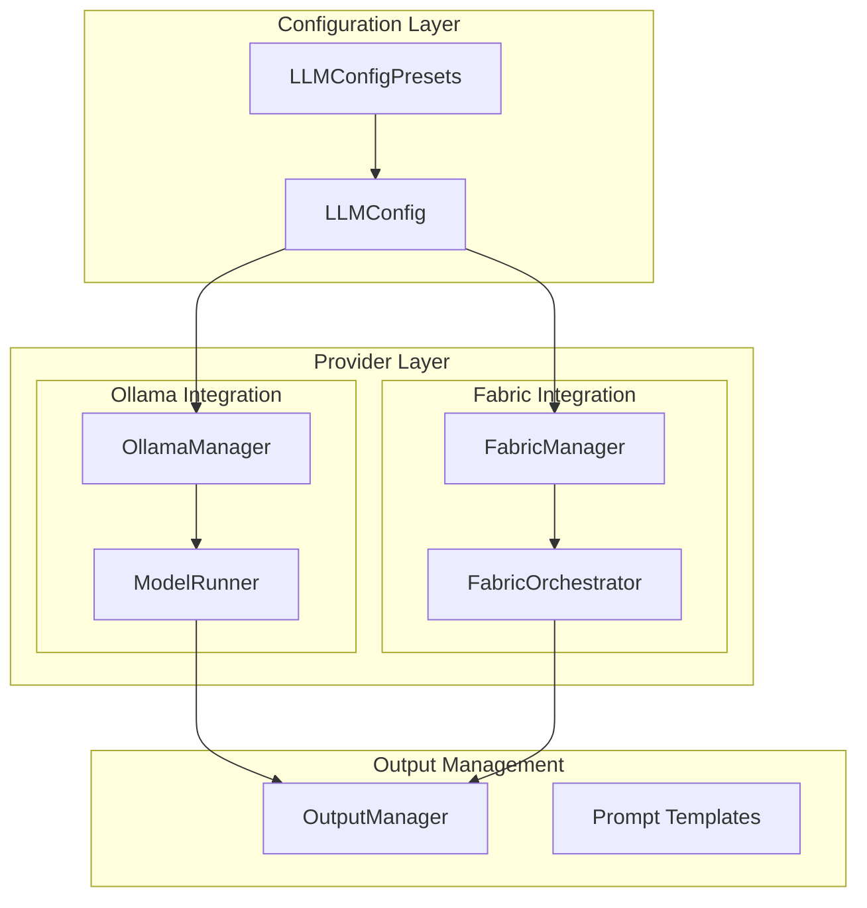

# LLM Module

**Version**: v0.1.0 | **Status**: Active | **Last Updated**: January 2026

## Overview

The LLM module provides infrastructure for integrating Large Language Models into the Codomyrmex ecosystem. It supports both local models (via Ollama) and external providers, with a unified configuration system and output management.

## Key Features

- **Ollama Integration**: Full support for local Ollama models
- **Fabric Integration**: Daniel Miessler's Fabric patterns and orchestration
- **Unified Configuration**: Centralized LLM settings and presets
- **Output Management**: Structured storage and retrieval of model outputs
- **Prompt Templates**: Reusable prompt template library

## Architecture



## Directory Structure

```
llm/
├── __init__.py          # Package exports
├── config.py            # LLMConfig, presets, get/set_config
├── ollama/              # Ollama model management
│   ├── manager.py       # OllamaManager
│   ├── runner.py        # ModelRunner
│   └── output.py        # OutputManager
├── fabric/              # Fabric patterns integration
│   ├── manager.py       # FabricManager
│   ├── orchestrator.py  # FabricOrchestrator
│   └── config.py        # FabricConfigManager
├── outputs/             # Stored model outputs
└── prompt_templates/    # Reusable prompt library
```

## Quick Start

### Using Ollama

```python
from codomyrmex.llm import OllamaManager, ModelRunner

# Initialize
manager = OllamaManager()
await manager.ensure_running()

# Run a model
runner = ModelRunner(model="llama3.2")
response = await runner.generate("Explain async/await in Python")
print(response.text)
```

### Using Fabric Patterns

```python
from codomyrmex.llm import FabricManager, FabricOrchestrator

# Load fabric patterns
fabric = FabricManager()
fabric.load_patterns()

# Orchestrate a workflow
orchestrator = FabricOrchestrator()
result = orchestrator.run_pattern(
    pattern="summarize",
    input_text="Long document..."
)
```

### Configuration Management

```python
from codomyrmex.llm import get_config, set_config, LLMConfigPresets

# Get current config
config = get_config()

# Apply a preset
set_config(LLMConfigPresets.LOCAL_FAST)

# Custom configuration
set_config(LLMConfig(
    provider="ollama",
    model="llama3.2",
    temperature=0.7,
    max_tokens=2048
))
```

## Key Classes

| Class | Purpose |
|-------|---------|
| `LLMConfig` | Configuration container for LLM settings |
| `LLMConfigPresets` | Pre-defined configuration presets |
| `OllamaManager` | Manages Ollama server lifecycle |
| `ModelRunner` | Executes inference on models |
| `OutputManager` | Stores and retrieves model outputs |
| `FabricManager` | Manages Fabric patterns |
| `FabricOrchestrator` | Coordinates Fabric workflows |

## Integration Points

- **agents/**: Agents use LLM module for AI reasoning
- **cerebrum/**: Connects to LLM for enhanced inference
- **model_context_protocol/**: MCP tool specifications for LLM

## Navigation

- **Parent**: [../README.md](../README.md)
- **Siblings**: [agents](../agents/README.md), [model_context_protocol](../model_context_protocol/README.md)
- **Spec**: [SPEC.md](SPEC.md)
- **API**: [API_SPECIFICATION.md](API_SPECIFICATION.md)
