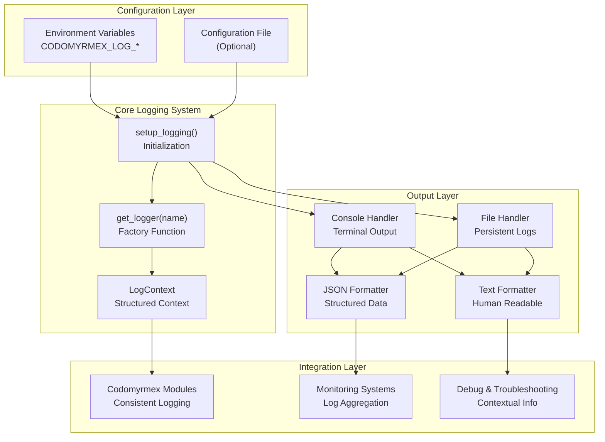
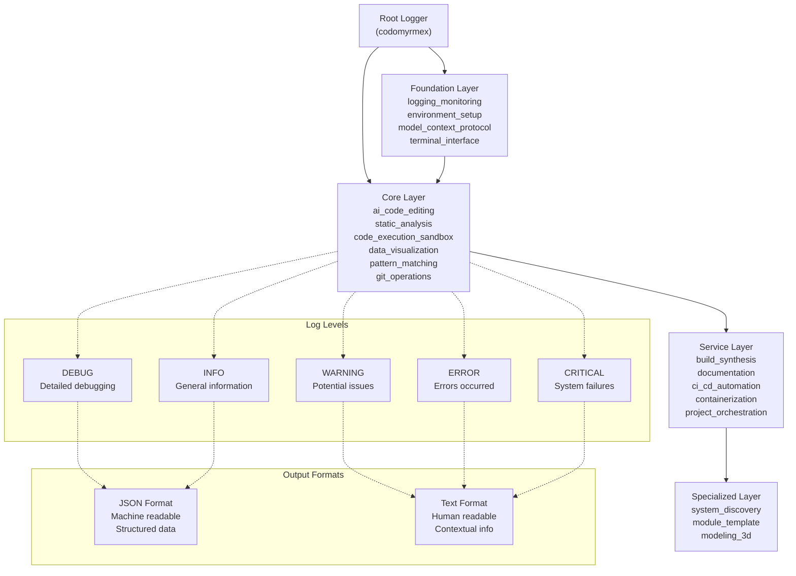

# src/codomyrmex/logging_monitoring

## Signposting
- **Parent**: [Parent](../README.md)
- **Children**:
    - [docs](docs/README.md)
    - [tests](tests/README.md)
- **Key Artifacts**:
    - [Agent Guide](AGENTS.md)
    - [Functional Spec](SPEC.md)

**Version**: v0.1.0 | **Status**: Active | **Last Updated**: December 2025

## Overview

Foundation module providing centralized logging infrastructure for the Codomyrmex platform. This module implements a unified logging system that ensures consistent log formatting, configurable output destinations, and proper log level management across all platform components.

The logging_monitoring module serves as the backbone for observability, enabling debugging, monitoring, and troubleshooting throughout the entire Codomyrmex ecosystem.

## Directory Contents
- `.cursor/` – Subdirectory
- `.gitignore` – File
- `API_SPECIFICATION.md` – File
- `CHANGELOG.md` – File
- `MCP_TOOL_SPECIFICATION.md` – File
- `SECURITY.md` – File
- `USAGE_EXAMPLES.md` – File
- `__init__.py` – File
- `docs/` – Subdirectory
- `logger_config.py` – File
- `requirements.txt` – File
- `tests/` – Subdirectory

## Architecture

### Logging System Architecture

### Logger Hierarchy and Flow

## Navigation
- **Project Root**: [README](../../../README.md)
- **Parent Directory**: [codomyrmex](../README.md)
- **Src Hub**: [src](../../../src/README.md)