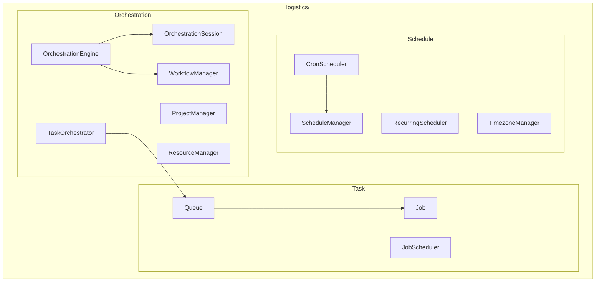

# Logistics Module

**Version**: v0.1.0 | **Status**: Active | **Last Updated**: January 2026

## Overview

The Logistics module provides orchestration, task management, and scheduling capabilities for coordinating workflows, jobs, and time-based execution in the Codomyrmex platform.

## Architecture



## Key Classes

### Orchestration

| Class | Purpose |
|-------|---------|
| `OrchestrationEngine` | Main orchestration engine |
| `OrchestrationSession` | Orchestration session |
| `WorkflowManager` | Workflow lifecycle |
| `TaskOrchestrator` | Task coordination |
| `ProjectManager` | Project management |
| `ResourceManager` | Resource allocation |

### Task

| Class | Purpose |
|-------|---------|
| `Queue` | Task queue |
| `Job` | Job definition |
| `JobScheduler` | Job scheduling |

### Schedule

| Class | Purpose |
|-------|---------|
| `ScheduleManager` | Schedule orchestration |
| `CronScheduler` | Cron-based scheduling |
| `CronExpression` | Cron expression parsing |
| `RecurringScheduler` | Recurring tasks |
| `RecurringSchedule` | Recurring schedule def |
| `TimezoneManager` | Timezone handling |

## Quick Start

### Workflow Management

```python
from codomyrmex.logistics import WorkflowManager, OrchestrationEngine

engine = OrchestrationEngine()
workflows = WorkflowManager(engine)

# Create workflow
workflow = workflows.create("data-pipeline")
workflow.add_step("extract", extract_data)
workflow.add_step("transform", transform_data)
workflow.add_step("load", load_data)

# Run workflow
result = workflows.run("data-pipeline")
```

### Task Queue

```python
from codomyrmex.logistics import Queue, Job, JobScheduler

queue = Queue("default")
scheduler = JobScheduler()

# Add job
job = Job(
    name="process-file",
    func=process_file,
    args=["input.csv"]
)
queue.enqueue(job)

# Process jobs
scheduler.process(queue)
```

### Cron Scheduling

```python
from codomyrmex.logistics import CronScheduler, CronExpression

scheduler = CronScheduler()

# Schedule job
scheduler.schedule(
    "backup-db",
    CronExpression("0 0 * * *"),  # Daily at midnight
    func=backup_database
)

scheduler.start()
```

### Recurring Schedule

```python
from codomyrmex.logistics import RecurringScheduler, RecurringSchedule

scheduler = RecurringScheduler()

schedule = RecurringSchedule(
    interval_minutes=30,
    start_time="09:00",
    end_time="17:00"
)

scheduler.add("health-check", schedule, health_check)
```

## Integration Points

- **orchestrator**: Workflow integration
- **ci_cd_automation**: Pipeline scheduling
- **events**: Event-driven scheduling

## Navigation

- **Parent**: [../README.md](../README.md)
- **Siblings**: [orchestrator](../orchestrator/), [events](../events/)
- **Spec**: [SPEC.md](SPEC.md)
