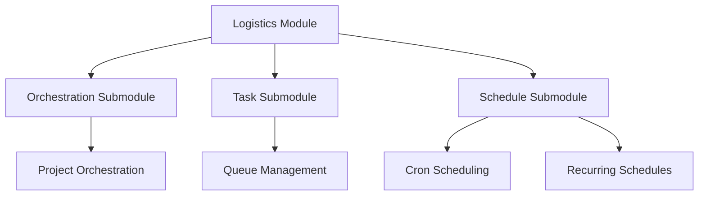

# logistics - Functional Specification

**Version**: v0.1.0 | **Status**: Active | **Last Updated**: January 2026

## Purpose

The logistics module consolidates orchestration, task management, and scheduling capabilities for coordinating workflows, jobs, and time-based execution.

## Design Principles

### Modularity

- Clear separation between orchestration, task, and schedule concerns
- Each submodule is self-contained with well-defined interfaces
- Extensible architecture for adding new logistics capabilities

### Internal Coherence

- Unified interfaces across submodules
- Consistent patterns for workflow, task, and schedule management
- Shared error handling and logging

### Functionality

- Orchestration: Complex workflow coordination with DAG execution
- Task: Backend-agnostic queue management with priority and retries
- Schedule: Advanced scheduling with cron patterns, recurring schedules, and timezone support

## Architecture

## Functional Requirements

### Orchestration

1. **Workflow Definition**: Define tasks and dependencies via config/code
2. **Execution**: Run tasks in correct topological order
3. **State Persistence**: Allow recovery from crashes

### Task

1. **Enqueue/Dequeue**: Add and remove jobs from queue
2. **Priority**: Support priority-based queuing
3. **Retries**: Automatic job retry on failure
4. **Monitoring**: Queue statistics and job status

### Schedule

1. **Cron Patterns**: Parse and execute cron-like schedules
2. **Recurring**: Define daily, weekly, monthly schedules
3. **Timezone**: Timezone-aware scheduling
4. **Integration**: Work with task queue for job execution

## Integration Points

- `logging_monitoring/` - Logging and monitoring
- `performance/` - Performance monitoring
- Other Codomyrmex modules for workflow coordination

## Quality Standards

### Code Quality

- Type hints for all functions
- PEP 8 compliance
- Comprehensive error handling

### Testing Standards

- ≥80% coverage
- Submodule-specific tests
- Integration tests

### Documentation Standards

- README.md, AGENTS.md, SPEC.md for each submodule
- API specifications
- Usage examples

## Navigation

- **Human Documentation**: [README.md](README.md)
- **Technical Documentation**: [AGENTS.md](AGENTS.md)
- **Parent**: [../SPEC.md](../SPEC.md)

<!-- Navigation Links keyword for score -->
