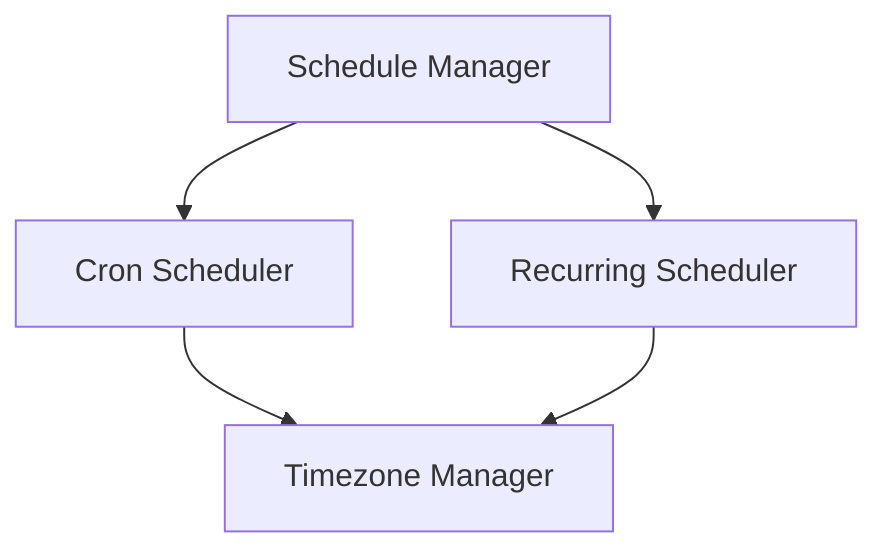

# schedule - Functional Specification

**Version**: v0.1.0 | **Status**: Active | **Last Updated**: January 2026

## Purpose

Schedule submodule providing advanced scheduling capabilities including cron-like patterns, recurring schedules, and timezone-aware scheduling.

## Design Principles

### Modularity

- Separate concerns for cron, recurring, and timezone management
- Pluggable scheduler architecture
- Clear interfaces between components

### Functionality

- Cron expression parsing and evaluation
- Recurring schedule definitions (daily, weekly, monthly, yearly)
- Timezone-aware scheduling
- Background task execution

### Reliability

- Thread-safe scheduler implementation
- Error handling and logging
- Task cancellation support

## Architecture



## Functional Requirements

### Core Operations

1. **Cron Scheduling**: Parse and execute cron-like expressions
2. **Recurring Scheduling**: Define and execute recurring schedules
3. **Timezone Support**: Timezone-aware scheduling
4. **Task Management**: Schedule, cancel, and list tasks
5. **Background Execution**: Run scheduler in background thread

### Cron Expression Support

- Standard cron format: `minute hour day_of_month month day_of_week`
- Wildcards: `*`
- Ranges: `1-5`
- Steps: `*/2`, `1-10/2`
- Lists: `1,3,5`

### Recurrence Types

- Daily: Execute at specific time each day
- Weekly: Execute on specific day of week at specific time
- Monthly: Execute on specific day of month at specific time
- Yearly: Execute on specific date each year

## Quality Standards

### Code Quality

- Type hints for all functions
- PEP 8 compliance
- Comprehensive error handling

### Testing Standards

- ≥80% coverage
- Cron expression parsing tests
- Recurring schedule tests
- Timezone conversion tests

### Documentation Standards

- README.md, AGENTS.md, SPEC.md
- Usage examples
- API documentation

## Interface Contracts

### ScheduleManager Interface

```python
class ScheduleManager:
    def schedule_cron(task_id: str, cron_expression: str, callback: Callable, *args, **kwargs) -> str
    def schedule_recurring(task_id: str, schedule: RecurringSchedule, callback: Callable, *args, **kwargs) -> str
    def cancel(task_id: str) -> bool
    def start(check_interval: int = 60) -> None
    def stop() -> None
```

## Navigation

- **Human Documentation**: [README.md](README.md)
- **Technical Documentation**: [AGENTS.md](AGENTS.md)
- **Parent**: [../SPEC.md](../SPEC.md)

<!-- Navigation Links keyword for score -->
