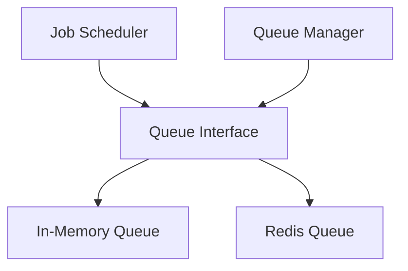

# task - Functional Specification

**Version**: v0.1.7 | **Status**: Active | **Last Updated**: February 2026

## Purpose

Task queue module providing task queue management, job scheduling, and async task execution. Integrates with `logistics.orchestration` for workflow task management.

## Design Principles

### Modularity

- Backend-agnostic queue interface
- Support for in-memory, Redis, and other backends
- Pluggable queue system

### Internal Coherence

- Unified job interface
- Consistent scheduling patterns
- Integration with orchestration

### Parsimony

- Essential queue operations
- Minimal dependencies
- Focus on common queue patterns

### Functionality

- Working implementations for common backends
- Support for priority queues
- Job retry and failure handling

### Testing

- Unit tests for all backends
- Integration tests with real queues
- Job execution tests

### Documentation

- Complete API specifications
- Usage examples for each backend
- Job scheduling documentation

## Architecture



## Functional Requirements

### Core Operations

1. **Enqueue/Dequeue**: Add and remove jobs from queue
2. **Scheduling**: Schedule jobs for future execution
3. **Priority**: Support priority-based queuing
4. **Retries**: Automatic job retry on failure
5. **Monitoring**: Queue statistics and job status

### Integration Points

- `logistics.orchestration/` - Workflow task queuing
- `performance/` - Queue performance monitoring
- `logging_monitoring/` - Job execution logging

## Quality Standards

### Code Quality

- Type hints for all functions
- PEP 8 compliance
- Comprehensive error handling

### Testing Standards

- ≥80% coverage
- Backend-specific tests
- Job execution tests

### Documentation Standards

- README.md, AGENTS.md, SPEC.md
- API_SPECIFICATION.md
- USAGE_EXAMPLES.md

## Interface Contracts

### Queue Interface

```python
class Queue:
    def enqueue(job: Job, priority: int = 0) -> str
    def dequeue() -> Optional[Job]
    def schedule(job: Job, when: datetime) -> str
    def get_status(job_id: str) -> JobStatus
```

## Implementation Guidelines

### Queue Implementation

1. Implement Queue interface for each backend
2. Handle job serialization
3. Support priority and scheduling
4. Provide job status tracking

### Integration

1. Integrate with logistics.orchestration
2. Add queue monitoring
3. Support job logging

## Navigation

- **Parent**: [logistics](../AGENTS.md)
- **Related**: [orchestration](../orchestration/AGENTS.md), [performance](../../performance/AGENTS.md)

<!-- Navigation Links keyword for score -->
