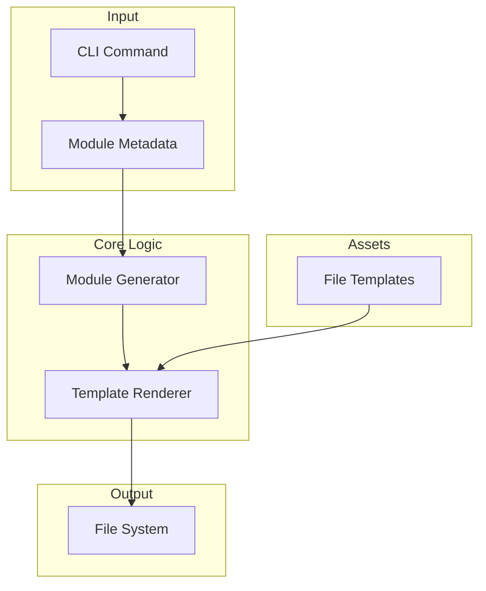

# market - Functional Specification

**Version**: v0.1.0 | **Status**: Active | **Last Updated**: January 2026

## Purpose

The `market` module provides the scaffolding and generation logic for creating *new* Codomyrmex modules. It ensures that all new modules start with the required structure, documentation files (`README`, `AGENTS`, `SPEC`), and configuration, enforcing the "Internal Coherence" design principle from day one.

## Design Principles

### Modularity

- **Template Driven**: Uses Jinja2 or similar string substitution to generate files from `src/codomyrmex/template` or internal assets.
- **Generator Pattern**: Separation between the configuration of a new module and the disk I/O.

### Internal Coherence

- **Dogfooding**: The template it generates MUST match the standards enforced by `cursorrules` and the documentation overhaul.
- **Standards Enforcement**: It pre-populates `SPEC.md`, `README.md`, and `AGENTS.md` with the correct boilerplate.

### Parsimony

- **Simple Inputs**: Should only require a module name (snake_case) and a human-readable name.

### Functionality

- **Idempotency**: Can "upgrade" an existing folder to a module (adding missing files) without overwriting existing code (unless forced).

## Architecture

## Functional Requirements

### Core Capabilities

1. **Scaffolding**: Create folder structure (`src/codomyrmex/<name>`, `tests/`, `docs/`).
2. **File Generation**: Render `__init__.py`, `README.md`, `AGENTS.md`, `SPEC.md` with placeholders filled.
3. **Registration**: Optionally register the new module in `system_discovery` or main `README` (though typically discovery is dynamic).

### Quality Standards

- **Valid Output**: Generated code must pass linting immediately.
- **Documentation**: Generated docs must represent the "Ideal" state (no "Requirement 1" placeholders if possible, or at least standardized TODOs).

## Interface Contracts

### Public API

- `create_module(name: str, description: str) -> Path`: Creates the module.
- `update_module_boilerplate(path: Path) -> None`: Updates standard files in an existing module.

### Dependencies

- **Internal**: `codomyrmex.logging_monitoring`.

## Implementation Guidelines

### Usage Patterns

- Run via CLI: `codomyrmex create-module my_new_feature`.

## Navigation

- **Human Documentation**: [README.md](README.md)
- **Technical Documentation**: [AGENTS.md](AGENTS.md)
- **Package SPEC**: [../SPEC.md](../SPEC.md)
