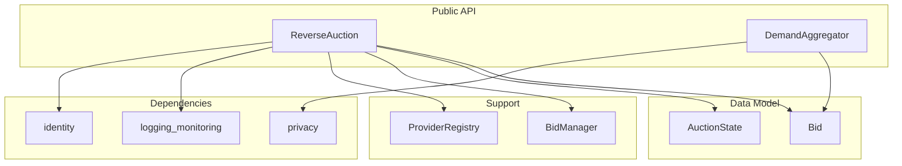

# market - Functional Specification

**Version**: v0.1.0 | **Status**: Active | **Last Updated**: February 2026

## Purpose

The `market` module facilitates anonymous economic coordination for Secure Cognitive Agents. It implements reverse auctions where agents post demands without revealing identity, and demand aggregation to pool purchasing power for collective bargaining.

## Design Principles

### Modularity

- Auction lifecycle decoupled from identity resolution
- Pluggable bid evaluation strategies
- Demand aggregation independent of auction mechanism

### Internal Coherence

- Consistent auction state machine (Open -> Bid -> Close/Cancel)
- Unified bid data model across auction types
- Integration with identity module for persona-based anonymity

### Parsimony

- Minimal transaction metadata — only what's needed for matching
- Simple API for common marketplace operations
- No persistent state beyond active auctions

### Functionality

- Reverse auctions: buyers post demands, providers bid
- Demand aggregation: bundle identical demands for bulk negotiation
- Anonymous transaction history tracking
- Provider registry for service verification

### Testing

- Unit tests for auction lifecycle
- Bid evaluation strategy tests
- Demand aggregation correctness tests

### Documentation

- Complete API specifications
- Auction lifecycle reference
- Demand aggregation examples

## Architecture



## Functional Requirements

### Core Capabilities

1. **Reverse Auction Creation**: Post demands anonymously via `ReverseAuction.create_request()`
2. **Bid Submission**: Providers submit bids via `ReverseAuction.place_bid()`
3. **Bid Evaluation**: Select best bid via `ReverseAuction.get_best_bid()`
4. **Demand Aggregation**: Bundle identical demands via `DemandAggregator.join_demand()`
5. **Auction Lifecycle**: Manage state transitions (Open -> Bid -> Close/Cancel)
6. **Transaction History**: Track participation anonymously

### Integration Points

- `identity/` - Persona-based anonymous participation
- `privacy/` - Scrub transaction metadata
- `wallet/` - Payment signing for completed auctions
- `logging_monitoring/` - Marketplace event logging

## Quality Standards

### Code Quality

- Type hints for all functions
- PEP 8 compliance
- Anonymity-preserving design patterns

### Testing Standards

- ≥80% coverage
- Auction state machine tests
- Bid ordering and selection tests

### Documentation Standards

- README.md, AGENTS.md, SPEC.md
- Auction lifecycle documentation
- Provider onboarding guide

## Interface Contracts

### ReverseAuction API

```python
class ReverseAuction:
    def create_request(persona_id: str, description: str, max_price: float) -> str
    def place_bid(auction_id: str, provider_id: str, price: float, details: str) -> None
    def get_best_bid(auction_id: str) -> Optional[Bid]
    def close_auction(auction_id: str) -> Bid
    def cancel_auction(auction_id: str) -> None
    def get_auction_status(auction_id: str) -> AuctionState
```

### DemandAggregator API

```python
class DemandAggregator:
    def join_demand(item: str, persona_id: str) -> str
    def get_aggregate(item: str) -> dict
    def list_active_demands() -> List[dict]
```

### Dependencies

- **Internal**: `codomyrmex.identity`, `codomyrmex.privacy`, `codomyrmex.logging_monitoring`.

## Implementation Guidelines

### Auction Management

1. Enforce state machine transitions — no invalid state changes
2. All participant references use persona IDs, never real identities
3. Bid evaluation is pluggable (lowest price, weighted score, etc.)

### Demand Aggregation

1. Group demands by normalized item descriptions
2. Track participant count without revealing individual identities
3. Trigger bulk negotiation when threshold is reached

## Navigation

- **Human Documentation**: [README.md](README.md)
- **Technical Documentation**: [AGENTS.md](AGENTS.md)
- **Package SPEC**: [../SPEC.md](../SPEC.md)
