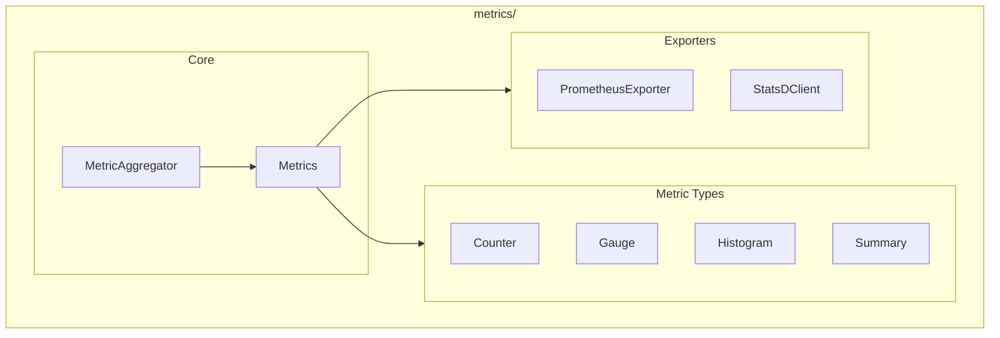

# Metrics Module

**Version**: v0.1.0 | **Status**: Active | **Last Updated**: January 2026

## Overview

The Metrics module provides metrics collection, aggregation, and export capabilities for the Codomyrmex platform. It supports multiple backends including in-memory, Prometheus, and StatsD.

## Architecture



## Key Classes

| Class | Purpose |
|-------|---------|
| `Metrics` | Main metrics container |
| `Counter` | Monotonically increasing counter |
| `Gauge` | Value that can go up/down |
| `Histogram` | Distribution of values |
| `Summary` | Statistical summary |
| `MetricAggregator` | Aggregate metrics across sources |
| `PrometheusExporter` | Export to Prometheus (optional) |
| `StatsDClient` | Export to StatsD (optional) |

## Quick Start

### Basic Metrics

```python
from codomyrmex.metrics import get_metrics, Counter, Gauge

metrics = get_metrics()

# Create a counter
requests = Counter("http_requests_total", "Total HTTP requests")
requests.inc()  # Increment by 1
requests.inc(5)  # Increment by 5

# Create a gauge
active_users = Gauge("active_users", "Currently active users")
active_users.set(42)
active_users.inc()
active_users.dec()
```

### Histogram and Summary

```python
from codomyrmex.metrics import Histogram, Summary

# Track request latency distribution
latency = Histogram(
    "request_latency_seconds",
    "Request latency",
    buckets=[0.01, 0.05, 0.1, 0.5, 1.0, 5.0]
)
latency.observe(0.234)

# Statistical summary
response_size = Summary("response_size_bytes", "Response size")
response_size.observe(1024)
```

### Prometheus Export

```python
from codomyrmex.metrics import PrometheusExporter

exporter = PrometheusExporter(port=9090)
exporter.start()  # Serves /metrics endpoint
```

### StatsD Export

```python
from codomyrmex.metrics import StatsDClient

statsd = StatsDClient(host="localhost", port=8125)
statsd.incr("page.views")
statsd.gauge("queue.size", 42)
statsd.timing("db.query", 123)  # milliseconds
```

## Integration Points

- **logging_monitoring**: Complements logging with metrics
- **performance**: Performance measurement
- **orchestrator**: Workflow metrics

## Navigation

- **Parent**: [../README.md](../README.md)
- **Siblings**: [logging_monitoring](../logging_monitoring/), [performance](../performance/)
- **Spec**: [SPEC.md](SPEC.md)
