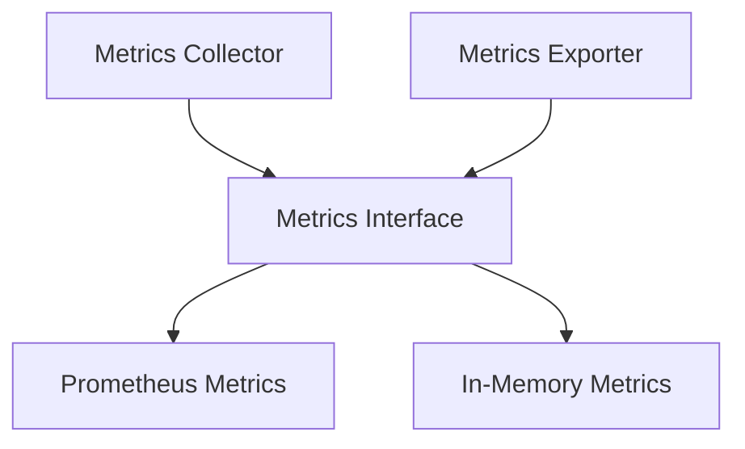

# metrics - Functional Specification

**Version**: v0.1.0 | **Status**: Proposed | **Last Updated**: January 2026

## Purpose

Metrics module providing metrics collection, aggregation, and Prometheus integration. Integrates with `performance` and `logging_monitoring` modules.

## Design Principles

### Modularity

- Backend-agnostic metrics interface
- Support for Prometheus and other backends
- Pluggable metrics system

### Internal Coherence

- Unified metric types
- Consistent aggregation patterns
- Integration with monitoring

### Parsimony

- Essential metrics operations
- Minimal dependencies
- Focus on common metric types

### Functionality

- Working implementations for common backends
- Support for custom metrics
- Metric aggregation and export

### Testing

- Unit tests for all backends
- Integration tests with Prometheus
- Metric collection tests

### Documentation

- Complete API specifications
- Usage examples for each backend
- Prometheus integration documentation

## Architecture



## Functional Requirements

### Core Operations

1. **Counter**: Increment counters
2. **Gauge**: Set gauge values
3. **Histogram**: Record histogram values
4. **Summary**: Record summary statistics
5. **Export**: Export metrics to backends

### Integration Points

- `performance/` - Performance metrics
- `logging_monitoring/` - Metrics logging
- `system_discovery/` - System metrics

## Quality Standards

### Code Quality

- Type hints for all functions
- PEP 8 compliance
- Comprehensive error handling

### Testing Standards

- ≥80% coverage
- Backend-specific tests
- Metric collection tests

### Documentation Standards

- README.md, AGENTS.md, SPEC.md
- API_SPECIFICATION.md
- USAGE_EXAMPLES.md

## Interface Contracts

### Metrics Interface

```python
class Metrics:
    def counter(name: str, labels: dict = None) -> Counter
    def gauge(name: str, labels: dict = None) -> Gauge
    def histogram(name: str, labels: dict = None) -> Histogram
    def export() -> dict

### `MetricAggregator`

- `increment(name: str, value: float)`
- `set_gauge(name: str, value: float)`
- `get_snapshot() -> dict`
- `reset() -> None`
```

## Implementation Guidelines

### Metrics Implementation

1. Implement Metrics interface for each backend
2. Handle metric collection
3. Support label-based metrics
4. Provide metric export

### Integration

1. Integrate with performance module
2. Add metrics to logging
3. Support system metrics

## Navigation

- **Parent**: [codomyrmex](../AGENTS.md)
- **Related**: [performance](../performance/AGENTS.md), [logging_monitoring](../logging_monitoring/AGENTS.md)

<!-- Navigation Links keyword for score -->
