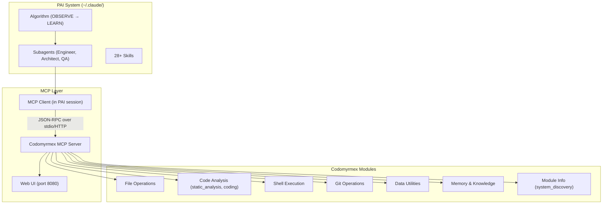

# Personal AI Infrastructure — Model Context Protocol Module

**Version**: v1.0.5 | **Status**: Active | **Last Updated**: March 2026

## Overview

The Model Context Protocol (MCP) module is **the operational bridge** between the PAI system (`~/.claude/PAI/`) and codomyrmex. PAI is TypeScript/Bun; codomyrmex is Python. MCP is the JSON-RPC protocol that connects them, exposing 33 tools across file operations, code analysis, git, shell execution, memory, and module introspection.

## Architecture



**Flow**: PAI Algorithm phase → capability selection → agent spawned → agent calls MCP tool → codomyrmex server routes to `tools.py` implementation → result returned to agent.

## Transports

| Transport | Protocol | Use Case | Command |
|-----------|----------|----------|---------|
| **stdio** | JSON-RPC over stdin/stdout | Claude Desktop, Claude Code (production) | `--transport stdio` |
| **HTTP** | FastAPI + Uvicorn, REST + Streamable HTTP | Browser access, remote clients, Web UI | `--transport http --port 8080` |

The HTTP transport includes a self-contained **Web UI** at the root URL (`/`) with interactive tool testing, server info, resource browsing, and prompt browsing.

## HTTP Endpoints (8 REST + 1 JSON-RPC)

| Endpoint | Method | Purpose |
|----------|--------|---------|
| `/` | GET | Web UI — interactive tool tester and server dashboard |
| `/health` | GET | Health check — returns status, tool/resource/prompt counts, protocol version |
| `/mcp` | POST | JSON-RPC endpoint (Streamable HTTP) for MCP protocol messages |
| `/tools` | GET | List all registered tools with schemas |
| `/tools/{name}` | GET | Get a single tool's schema and parameters |
| `/tools/{name}/call` | POST | Execute a tool — body is raw arguments (server wraps as `arguments`) |
| `/resources` | GET | List registered resources |
| `/prompts` | GET | List registered prompt templates |

## Available Tools (33 Total)

### Built-in Tools (15) — Fully Implemented

All built-in tools delegate to `tools.py` implementations with real functionality:

| Category | Tool | Description | PAI Phase |
|----------|------|-------------|-----------|
| **File Ops** | `read_file` | Read file contents with metadata (size, lines, mtime) | All |
| **File Ops** | `write_file` | Write content, creating parent dirs if needed | BUILD |
| **File Ops** | `list_directory` | List directory with filtering, pagination, metadata | OBSERVE |
| **Code** | `search_code` | Regex search across code files with type filtering | OBSERVE |
| **Code** | `analyze_python_file` | Python AST analysis: classes, functions, imports, metrics | VERIFY |
| **Shell** | `run_command` | Execute shell commands with timeout and env support | EXECUTE |
| **Git** | `git_status` | Branch, changed files, recent commits | OBSERVE |
| **Git** | `git_diff` | File diffs, optionally staged only | OBSERVE |
| **Data** | `json_query` | Read/query JSON files with dot-notation paths | OBSERVE |
| **Data** | `checksum_file` | Calculate MD5, SHA1, or SHA256 checksums | VERIFY |
| **Memory** | `store_memory` | Store key-value pair in session memory | LEARN |
| **Memory** | `recall_memory` | Retrieve value from session memory | OBSERVE |
| **Memory** | `list_memories` | List all stored memory keys | OBSERVE |
| **Module** | `list_modules` | List all codomyrmex modules | OBSERVE |
| **Module** | `module_info` | Get module info and file listing for a specific module | OBSERVE |

### Discovered Tools (~18) — From MCP Specifications

Additional tools are auto-discovered from `MCP_TOOL_SPECIFICATION.md` files across all modules. These are prefixed with `{module}__` to avoid collisions (e.g., `git_operations__git_status`). Tools with matching entries in `_SPEC_TOOL_IMPLEMENTATIONS` are wired to real `tools.py` functions; others return structured metadata as spec-only placeholders.

### Registered Resources

| Resource | Type | Description |
|----------|------|-------------|
| `file://.../README.md` | `text/markdown` | Main project documentation |

### Registered Prompts

| Prompt | Arguments | Description |
|--------|-----------|-------------|
| `code_review` | `focus`, `code` | Review code for security, performance, or style |
| `explain_code` | `detail_level`, `code` | Explain code at brief, detailed, or expert level |

## Web UI

The Web UI (`web_ui.py`) is a self-contained HTML/CSS/JS application served at `GET /` when the HTTP transport is active. It provides:

| Tab | Features |
|-----|----------|
| **Tools** | Searchable tool list, click to select, parameter form auto-generated from inputSchema, Execute button with JSON result display |
| **Resources** | Browse registered resources with URI, name, MIME type |
| **Prompts** | Browse prompt templates with arguments |
| **Server Info** | Stats grid (tool count, resource count, prompt count, protocol version, server name, transport) |

The UI uses a dark theme with the codomyrmex accent color (`#6c8cff`), and the tool tester supports real-time tool execution against the running server.

## Key Classes and Files

| Class/File | Location | Purpose |
|------------|----------|---------|
| `MCPServer` | `server.py` | Full MCP server — tool/resource/prompt registration, JSON-RPC dispatch, stdio and HTTP transports |
| `MCPServerConfig` | `server.py` | Server configuration dataclass (name, version, transport, log_level) |
| `MCPToolRegistry` | `schemas/mcp_schemas.py` | Tool registration and execution engine |
| `MCPToolCall` | `schemas/mcp_schemas.py` | Tool call data model |
| `get_web_ui_html()` | `web_ui.py` | Self-contained HTML Web UI (524 lines) |
| `tools.py` | `tools.py` | All tool implementations (file, code, shell, git, data) |
| `discovery.py` | `discovery.py` | Auto-discover tools from `MCP_TOOL_SPECIFICATION.md` files |
| `run_mcp_server.py` | `scripts/model_context_protocol/` | Server runner — creates server, registers all tools, starts transport |

## Setup for PAI Users

### Step 1: Start the MCP Server

```bash
# stdio mode (for Claude Desktop / Claude Code)
uv run python scripts/model_context_protocol/run_mcp_server.py --transport stdio

# HTTP mode (with Web UI at http://localhost:8080/)
uv run python scripts/model_context_protocol/run_mcp_server.py --transport http --port 8080

# List all 33 available tools
uv run python scripts/model_context_protocol/run_mcp_server.py --list-tools
```

### Step 2: Register in Claude Desktop Config

Add to `~/.claude/claude_desktop_config.json`:

```json
{
  "mcpServers": {
    "codomyrmex": {
      "command": "python",
      "args": [
        "/absolute/path/to/codomyrmex/scripts/model_context_protocol/run_mcp_server.py",
        "--transport", "stdio"
      ]
    }
  }
}
```

### Step 3: Verify

```bash
# Quick verification via HTTP
curl http://localhost:8080/health
# → {"status":"ok","tool_count":33,"resource_count":1,"prompt_count":2,...}

# Test a tool
curl -X POST http://localhost:8080/tools/git_status/call \
  -H "Content-Type: application/json" \
  -d '{"path":"."}'

# Open Web UI in browser
open http://localhost:8080/
```

## PAI Algorithm Phase Mapping

| Phase | MCP Module Contribution |
|-------|------------------------|
| **OBSERVE** | `git_status`, `git_diff`, `read_file`, `list_directory`, `search_code`, `list_modules`, `recall_memory` — gather system state |
| **THINK** | Tool schemas inform capability selection; `analyze_python_file` for code understanding |
| **PLAN** | `/health` endpoint shows tool inventory for planning; discovery bridge reveals available module tools |
| **BUILD** | `write_file` — create artifacts; `run_command` — run build scripts |
| **EXECUTE** | `run_command` — shell execution; all tools available for agent-driven work |
| **VERIFY** | `checksum_file` — integrity checks; `analyze_python_file` — code quality; `git_diff` — change validation |
| **LEARN** | `store_memory` — capture learnings; discovery system learns from new `MCP_TOOL_SPECIFICATION.md` files |

## MCP Introspection Tools

Three tools are auto-discovered via `@mcp_tool` from `model_context_protocol/mcp_tools.py` — these allow PAI agents to introspect the MCP server itself:

| Tool | Description | Trust Level | Category |
|------|-------------|-------------|----------|
| `inspect_server` | Inspect the running MCP server configuration, capabilities, and registered tools | Safe | model_context_protocol |
| `list_registered_tools` | List all tools currently registered with the MCP server, with schemas | Safe | model_context_protocol |
| `get_tool_schema` | Get the input/output schema for a specific registered tool | Safe | model_context_protocol |

## MCP Protocol Version

The server implements **MCP 2025-06-18** with:
- `protocolVersion: "2025-06-18"` in `initialize` response
- `title` field on tools (human-friendly display name)
- `outputSchema` support for structured tool output
- `structuredContent` in tool call responses when `outputSchema` is defined

## Extending: Custom Tools

Register additional codomyrmex module functions as MCP tools:

```python
from codomyrmex.model_context_protocol import MCPServer

server = MCPServer()

# Decorator style
@server.tool(
    name="my_analysis",
    title="My Analysis",  # MCP 2025-06-18
    description="Run custom analysis on code",
)
def my_analysis(code: str, options: str = "") -> str:
    return "analysis result"

# Manual registration
server.register_tool(
    name="my_tool",
    schema={"name": "my_tool", "description": "...", "inputSchema": {...}},
    handler=my_function,
    title="My Tool",
)
```

Any codomyrmex module can expose tools through MCP by adding an `MCP_TOOL_SPECIFICATION.md` file. The discovery bridge in `run_mcp_server.py` auto-discovers and registers these at startup.

## Navigation

- **Self**: [PAI.md](PAI.md)
- **Parent**: [../PAI.md](../PAI.md) — Source-level PAI module map
- **Root Bridge**: [../../../PAI.md](../../../PAI.md) — Authoritative PAI system bridge doc
- **Siblings**: [README.md](README.md) | [AGENTS.md](AGENTS.md) | [SPEC.md](SPEC.md) | [API_SPECIFICATION.md](API_SPECIFICATION.md)
- **Web UI**: [web_ui.py](web_ui.py) — Self-contained HTML interface
- **Tutorial**: [Connecting PAI to Codomyrmex](../../../docs/getting-started/tutorials/connecting-pai.md)
- **Server Script**: [run_mcp_server.py](../../../scripts/model_context_protocol/run_mcp_server.py)
- **Website Integration**: [../website/PAI.md](../website/PAI.md) — Dashboard probes MCP server for live status
