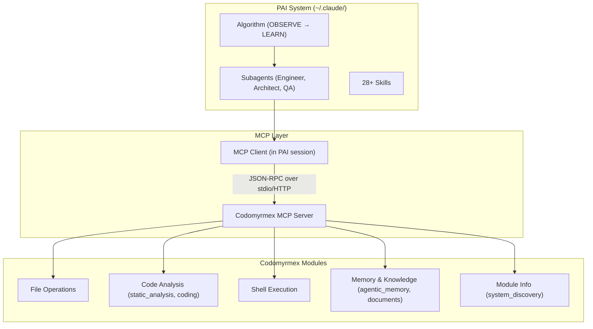

# Personal AI Infrastructure — Model Context Protocol Module

**Version**: v0.2.0 | **Status**: Active | **Last Updated**: February 2026

## Overview

The Model Context Protocol (MCP) module is **the operational bridge** between the PAI system (`~/.claude/skills/PAI/`) and codomyrmex. PAI is TypeScript/Bun; codomyrmex is Python. MCP is the protocol that connects them.

## Architecture



**Flow**: PAI Algorithm phase → capability selection → agent spawned → agent calls MCP tool → codomyrmex server routes to module → result returned to agent.

## Available Tools

The codomyrmex MCP server exposes these tool categories:

| Category | Tools | PAI Algorithm Phase |
|----------|-------|-------------------|
| **File Operations** | `read_file`, `write_file`, `list_directory`, `search_files` | All phases |
| **Code Analysis** | `analyze_code`, `lint_check`, `security_scan` | VERIFY |
| **Shell Execution** | `run_command`, `run_script` | EXECUTE |
| **Memory/Knowledge** | `store_memory`, `retrieve_memory`, `search_documents` | OBSERVE, LEARN |
| **Module Info** | `list_modules`, `module_status`, `module_health` | OBSERVE |

List all available tools:

```bash
python scripts/model_context_protocol/run_mcp_server.py --list-tools
```

## Setup for PAI Users

### Step 1: Start the MCP Server

```bash
# stdio mode (for Claude Desktop / Claude Code)
python scripts/model_context_protocol/run_mcp_server.py --transport stdio

# HTTP mode (for remote access)
python scripts/model_context_protocol/run_mcp_server.py --transport http --port 8080
```

### Step 2: Register in Claude Desktop Config

Add to `~/.claude/claude_desktop_config.json`:

```json
{
  "mcpServers": {
    "codomyrmex": {
      "command": "python",
      "args": [
        "/absolute/path/to/codomyrmex/scripts/model_context_protocol/run_mcp_server.py",
        "--transport", "stdio"
      ]
    }
  }
}
```

### Step 3: Verify

In a Claude Code session:
1. The PAI Algorithm will run on your prompt
2. During EXECUTE, agents can call codomyrmex tools via MCP
3. Check server logs for tool invocations

## Extending: Custom Tools

Register additional codomyrmex module functions as MCP tools:

```python
from codomyrmex.model_context_protocol import MCPServer

server = MCPServer()

# Register a custom tool from any codomyrmex module
server.register_tool(
    name="my_custom_analysis",
    handler=my_analysis_function,
    description="Run custom analysis on code",
    parameters={
        "code": {"type": "string", "description": "Code to analyze"},
        "options": {"type": "object", "description": "Analysis options"}
    }
)
```

Any codomyrmex module can expose tools through MCP by following this pattern. The MCP server discovers and registers tools from modules that implement the `MCP_TOOL_SPECIFICATION.md` interface.

## PAI Integration Points

| Component | PAI Use Case | Details |
|-----------|-------------|---------|
| `MCPServer` | Host codomyrmex tools for PAI agents | Primary bridge server |
| `MCPClient` | Consume external MCP servers from codomyrmex | For codomyrmex modules that need external tools |
| `MCPServerConfig` | Configure server behavior | Transport, port, tool registration |
| `MCP_TOOL_SPECIFICATION.md` | Per-module tool definitions | Each module declares its MCP-exposed tools |

## Navigation

- **Self**: [PAI.md](PAI.md)
- **Parent**: [../PAI.md](../PAI.md) — Source-level PAI module map
- **Root Bridge**: [../../../PAI.md](../../../PAI.md) — Authoritative PAI system bridge doc
- **Siblings**: [README.md](README.md) | [AGENTS.md](AGENTS.md) | [SPEC.md](SPEC.md)
- **Tutorial**: [Connecting PAI to Codomyrmex](../../../docs/getting-started/tutorials/connecting-pai.md)
- **Server Script**: [scripts/model_context_protocol/run_mcp_server.py](../../../scripts/model_context_protocol/run_mcp_server.py)
