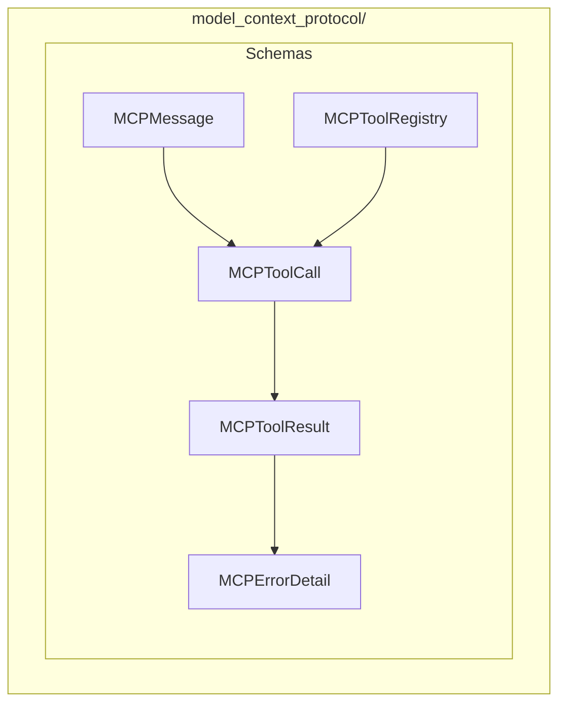

# Model Context Protocol Module

**Version**: v0.1.0 | **Status**: Active | **Last Updated**: January 2026

## Overview

The Model Context Protocol (MCP) module provides a foundational specification within the Codomyrmex ecosystem, designed to standardize communication and interactions between different components and external models.

## Architecture



## Key Classes

| Class | Purpose |
|-------|---------|
| `MCPMessage` | Message container |
| `MCPToolCall` | Tool call request |
| `MCPToolResult` | Tool execution result |
| `MCPErrorDetail` | Error details |
| `MCPToolRegistry` | Tool registration |

## Quick Start

### Create Messages

```python
from codomyrmex.model_context_protocol import MCPMessage, MCPToolCall

message = MCPMessage(
    role="assistant",
    content="I'll help you with that."
)
```

### Tool Calls

```python
from codomyrmex.model_context_protocol import MCPToolCall, MCPToolResult

# Create tool call
call = MCPToolCall(
    id="call-123",
    name="read_file",
    arguments={"path": "/path/to/file"}
)

# Create result
result = MCPToolResult(
    call_id="call-123",
    content="File contents here...",
    is_error=False
)
```

### Error Handling

```python
from codomyrmex.model_context_protocol import MCPErrorDetail

error = MCPErrorDetail(
    code="FILE_NOT_FOUND",
    message="The requested file does not exist",
    details={"path": "/path/to/missing"}
)
```

### Tool Registry

```python
from codomyrmex.model_context_protocol import MCPToolRegistry

registry = MCPToolRegistry()

# Register a tool
registry.register(
    name="search_code",
    description="Search for code patterns",
    parameters={
        "query": {"type": "string", "required": True}
    }
)

# Get tool schema
schema = registry.get_schema("search_code")
```

## Integration Points

- **agents**: Agent-model communication
- **llm**: Model interaction protocol
- **api**: API standardization

## Navigation

- **Parent**: [../README.md](../README.md)
- **Siblings**: [agents](../agents/), [llm](../llm/)
- **Spec**: [SPEC.md](SPEC.md)
