# src/codomyrmex/model_context_protocol

## Signposting
- **Parent**: [Parent](../README.md)
- **Children**:
    - [docs](docs/README.md)
    - [tests](tests/README.md)
- **Key Artifacts**:
    - [Agent Guide](AGENTS.md)
    - [Functional Spec](SPEC.md)

**Version**: v0.1.0 | **Status**: Active | **Last Updated**: December 2025

## Overview

Foundation module defining the Model Context Protocol (MCP) for standardized AI communication within the Codomyrmex platform. This module establishes the schemas, interfaces, and standards that enable consistent interaction between AI agents, language models, and platform components.

The model_context_protocol module serves as the communication backbone, ensuring reliable and structured AI interactions across the entire platform.

## MCP Communication Flow

### Message Validation Flow

```mermaid
flowchart TD
    Input[📨 Raw Message] --> Parse[🔍 Parse JSON]
    Parse --> Validate[✅ Validate Schema]
    Validate --> Process[⚙️ Process Message]

    Validate --> Invalid{Valid?}
    Invalid -->|No| Error[MCPErrorDetail<br/>Validation Error]
    Invalid -->|Yes| Process

    Process --> ToolCall{MCPToolCall?}
    ToolCall -->|Yes| Execute[🔧 Execute Tool]
    ToolCall -->|No| Response[📤 Direct Response]

    Execute --> Result[MCPToolResult<br/>Execution Result]
    Result --> Output[📤 Formatted Response]
    Response --> Output
    Error --> Output
```

## Directory Contents
- `.cursor/` – Subdirectory
- `.gitignore` – File
- `API_SPECIFICATION.md` – File
- `CHANGELOG.md` – File
- `MCP_TOOL_SPECIFICATION.md` – File
- `SECURITY.md` – File
- `USAGE_EXAMPLES.md` – File
- `__init__.py` – File
- `docs/` – Subdirectory
- `mcp_schemas.py` – File
- `requirements.txt` – File
- `tests/` – Subdirectory

## Navigation
- **Project Root**: [README](../../../README.md)
- **Parent Directory**: [codomyrmex](../README.md)
- **Src Hub**: [src](../../../src/README.md)