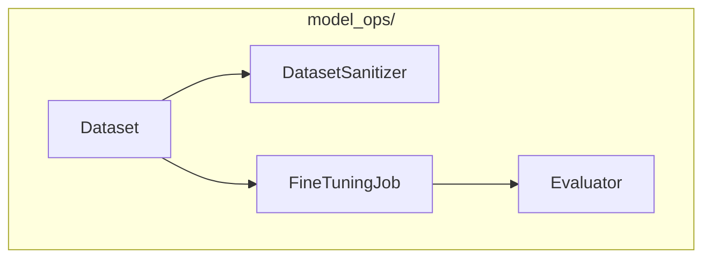

# Model Operations Module

**Version**: v0.1.0 | **Status**: Active | **Last Updated**: January 2026

## Overview

The Model Operations module provides ML model lifecycle management for the Codomyrmex platform, including dataset management, fine-tuning, and evaluation capabilities.

## Architecture



## Key Classes

| Class | Purpose |
|-------|---------|
| `Dataset` | Dataset management |
| `DatasetSanitizer` | Clean and prepare data |
| `FineTuningJob` | Model fine-tuning |
| `Evaluator` | Model evaluation |

## Quick Start

### Dataset Management

```python
from codomyrmex.model_ops import Dataset, DatasetSanitizer

# Create dataset
dataset = Dataset.from_jsonl("training_data.jsonl")

# Sanitize data
sanitizer = DatasetSanitizer()
clean_data = sanitizer.sanitize(dataset)
clean_data.save("clean_data.jsonl")
```

### Fine-Tuning

```python
from codomyrmex.model_ops import FineTuningJob, Dataset

dataset = Dataset.from_jsonl("training.jsonl")

job = FineTuningJob(
    model="gpt-4o-mini",
    dataset=dataset,
    epochs=3,
    learning_rate=1e-5
)

# Start training
job.start()

# Monitor progress
while job.status == "running":
    print(f"Progress: {job.progress:.1%}")
```

### Evaluation

```python
from codomyrmex.model_ops import Evaluator, Dataset

evaluator = Evaluator()

# Evaluate model
results = evaluator.evaluate(
    model="fine-tuned-model",
    dataset=Dataset.from_jsonl("test.jsonl"),
    metrics=["accuracy", "f1", "perplexity"]
)

print(f"Accuracy: {results.accuracy:.2%}")
```

## Integration Points

- **llm**: Model inference
- **agents**: Agent fine-tuning
- **cerebrum**: Neural operations

## Navigation

- **Parent**: [../README.md](../README.md)
- **Siblings**: [llm](../llm/), [cerebrum](../cerebrum/)
- **Spec**: [SPEC.md](SPEC.md)
